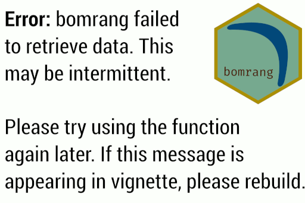

## Test environments

- local macOS install R version 3.5.3 (2019-03-11)

- Circle-CI debian:9 R version 3.5.3 (2019-03-11)

- win-builder R Under development (unstable) (2019-03-19 r76252)

- win-builder R version 3.5.3 (2019-03-11)

## R CMD check results

0 errors | 0 warnings | 1 note

This is a new minor release that adds new functionality, corrects bugs and
makes minor changes to documentation

## Bug fixes

- Update functionality of `get_precis_forecast()` and `get_coastal_forecast()`
to work with latest BOM XML files

## Major changes

- New print method for `get_historical()` and `get_current_weather()` using
`bomrang_tbl` class and re-exporting _dplyr_ methods to handle the new class

- Add new aliases for `get_current_weather()`, `get_current()` and
`get_historical()`, `get_historical_weather()` for consistency

- Add new aliases for `get_radar_imagery()`, `get_radar()` and
`get_satellite_imagery()`, `get_satellite()` to save typing

- If images fail to download for any functions, a default image is returned
with an error message to try again 

- `get_current_weather()` no longer has `raw` or `as.data.table` parameters, all
data are returned with columns in proper class as with all other _bomrang_
functions and the returned data.frame is a `bomrang_tbl` object. The `raw`
parameter was set to `FALSE` by default, so the effect should be minimal for
most end users.

## Minor changes

- Updates documentation formatting and corrects minor issues including
spellchecking package and correcting spelling where necessary

- Uses `curl` to download XML files before parsing them, rather than reading
directly from the server. `curl` gives more flexibility in handling the
server connections

- Uses `curl::curl_download()` in place of `utils::download.file()` for a
newer implementation of the same protocols

- Correct formatting of DESCRIPTION file to conform with CRAN guidelines

- Replaces `\dontrun{}` with `\donttest{}` for examples in documentation

## Reverse dependencies

* No ERRORs or WARNINGs found
