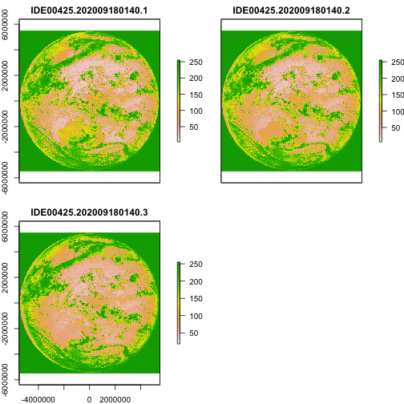

## Introduction

_bomrang_ provides functions for interacting with 
[Australian Bureau of Meteorology (BoM) Weather Data Services](http://www.bom.gov.au/catalogue/data-feeds.shtml) forecasts. BoM serves several types of data data as XML and JSON files. This
package fetches these files, parses them and return a tidy data frame.

## Using _bomrang_

Several functions are provided by _bomrang_ to retrieve Australian Bureau of
Meteorology (BoM) data. A family of functions retrieve weather data and return
tidy data frames; `get_precis_forecast()`, which retrieves the précis (short)
forecast; `get_current_weather()`, which fetches the current weather from a
given station; and `get_ag_bulletin()`, which retrieves the agriculture
bulletin. A second group of functions retrieve information pertaining to
satellite imagery, `get_available_imagery()` and the imagery itself,
`get_satellite_imagery()`. The last group functions provides internal functionality
for _bomrang_ itself; `update_forecast_locations()`, which updates an
internal database of forecast locations distributed with the package, 
`sweep_for_stations()` which returns the nearest weather stations to a point in
Australia and, `manage_cached_files()` that provides facilities for managing
cached satellite imagery.

## Using `get_current_weather`

`get_current_weather()` takes one of two arguments: `station_name` and `latlon`,
returning the current weather observations (and the observations of the last 72
hours) for the given location.

If `station_name` is used, the weather observations for the last 72 hours are
returned for that station. If the string provided is ambiguous, the function
returns an observation for one of the possible stations and emits a warning to
offer unambiguous station names. 

If `latlon` is used, the observations returned are from the station nearest to
that latitude-longitude coordinate. `latlon` values are entered as decimal
degrees, _e.g._ -34, 151 for Sydney. The function also emits a message, to
tell the user which station was used.

### Results

The table returned will have different fields depending on the station that is
selected. 

### Example

Following is an example fetching the current weather for Melbourne.

```{r, eval=FALSE}
library("bomrang")

Melbourne_weather <- get_current_weather("Melbourne (Olympic Park)")
head(Melbourne_weather)
```

## Using `get_precis_forecast`

This function only takes one argument, `state`. The `state` parameter allows the
user to select the forecast for just one state or a national forecast. States or
territories are specified using the official postal codes or full name with
fuzzy matching performed via `agrep()`

- **ACT** - Australian Capital Territory

- **NSW** - New South Wales

- **NT** - Northern Territory

- **QLD** - Queensland

- **SA** - South Australia

- **TAS** - Tasmania

- **VIC** - Victoria

- **WA** - Western Australia

- **AUS** - Australia, returns national forecast including all states, NT and
ACT.

### Results

The function, `get_precis_forecast()`, will return a data frame of the weather
forecast for the daily forecast for selected towns. See Appendix 1 for a full
description of the fields and values.

### Example

Following is an example fetching the forecast for Queensland.

```{r, eval=FALSE}
library("bomrang")

QLD_forecast <- get_precis_forecast(state = "QLD")
head(QLD_forecast)
```

## Using `get_ag_bulletin`

`get_ag_bulletin()` only takes one argument, `state`. The `state` parameter
allows the user to select the bulletin for just one state or a national
forecast. States or territories are specified using the official postal codes or
full name with fuzzy matching performed via `agrep()`.

- **NSW** - New South Wales

- **NT** - Northern Territory

- **QLD** - Queensland

- **SA** - South Australia

- **TAS** - Tasmania

- **VIC** - Victoria

- **WA** - Western Australia

- **AUS** - Australia, returns bulletin for all states and NT.

### Results

The function, `get_ag_bulletin()`, will return a data frame of the agriculture
bulletin for selected stations. See Appendix 3 for a full list and description
of the fields and values.

### Example

Following is an example fetching the ag bulletin for Queensland.

```{r, eval=FALSE}
library("bomrang")

QLD_bulletin <- get_ag_bulletin(state = "QLD")
head(QLD_bulletin)
```
## Using `sweep_for_stations`
`sweep_for_stations()` only takes one argument, `latlon`, a length-2 numeric
vector. By default, Canberra (approximately).

### Results
This function will search for weather stations and return a data frame of all
weather stations (in this package) sorted by distance from `latlon`, ascending.
The fields in the data frame are:

**name** - station name

**lat** - latitude (decimal degrees)

**lon** - longitude (decimal degrees)

**distance** - distance from provided `latlon` value (kilometres).

### Example  

Following is an example sweeping for stations starting with Canberra.

```{r, eval=FALSE}
# Show only the first ten stations in the list
head(sweep_for_stations(latlon = c(-35.3, 149.2)), 10)
```

## Using the update functions

_bomrang_ uses internal databases of station location data from BoM to provide
location and other metadata, _e.g._ elevation, station names, WMO codes, etc. to
make the process of querying for weather data faster. These databases are
created and packaged with _bomrang_ for distribution and are updated with new
releases. Users have the option of updating these databases after installing
_bomrang_. While this option gives the users the ability to keep the databases
up-to-date and gives _bomrang_'s authors flexibility in maintaining it, this
also means that reproducibility may be affected since the same version of
_bomrang_ may have different databases on different machines. If reproducibility
is necessary, care should be taken to ensure that the version of the databases
is the same across different machines.

The databases consist of three files, used by _bomrang_, `AAC_codes.rda`, 
`JSONurl_latlon_by_station_name.rda` and `stations_site_list.rda`. These files
can be located on your local system by using the following command, 
```{r, eval = FALSE}
paste0(.libPaths(), "/bomrang/extdata")[1]
```

unless you have specified another location for library installations and
installed _bomrang_ there, in which case it would still be in `bomrang/extdata`.

### Using `update_forecast_locations`

`update_forecast_locations()` downloads the latest précis forecast locations
from the BoM server and updates _bomrang_'s internal database of towns used for
forecast locations. This database is distributed with the package to make the
process faster when fetching the forecast. 

### Example

Following is an example updating the précis forecast locations internal
database.

```{r, eval=FALSE}
update_forecast_locations()
```

### Using `update_station_locations`

`update_station_locations()` downloads the latest station locations and metadata
and updates bomrang's internal databases that support the use of
`get_current_weather()` and `get_ag_bulletin()`. There is no need to use this
unless you know that a station exists in BoM's database that is not available in
the databases distributed with _bomrang_

### Example

Following is an example updating the précis forecast locations internal
database.

```{r, eval=FALSE}
update_station_locations()
```

## Using _bomrang_ to retrieve satellite imagery

_bomrang_ provides functionality to retrieve high-definition GeoTIFF satellite
imagery provided by BoM through public FTP with the following types of imagery
being available: i.)
[Infrared images](http://www.bom.gov.au/australia/satellite/about_images.shtml#ir),
ii.)
[Visible images](http://www.bom.gov.au/australia/satellite/about_images.shtml#vis)
and iii.)
[Clouds/surface composite](http://www.bom.gov.au/australia/satellite/about_images.shtml#cloud).

Valid BoM satellite Product IDs for GeoTIFF files include:

<table>
<tr><th>Product ID</th><th>Description</th><th>Type</th><th>Delete time</th></tr>
<tr><td>IDE00420</td><td>AHI cloud cover only 2km FD GEOS </td><td>Satellite</td><td style= "text-align: center;">24</td></tr>
<tr><td>IDE00421</td><td>AHI IR (Ch13) greyscale 2km FD GEOS </td><td>Satellite</td><td style= "text-align: center;">24</td></tr>
<tr><td>IDE00422</td><td>AHI VIS (Ch3) greyscale 2km FD GEOS </td><td>Satellite</td><td style= "text-align: center;">24</td></tr>
<tr><td>IDE00423</td><td>AHI IR (Ch13) Zehr 2km FD GEOS </td><td>Satellite</td><td style= "text-align: center;">24</td></tr>
<tr><td>IDE00425</td><td>AHI VIS (true colour) / IR (Ch13 greyscale) composite 1km FD GEOS </td><td>Satellite</td><td style= "text-align: center;">24</td></tr>
<tr><td>IDE00426</td><td>AHI VIS (true colour) / IR (Ch13 greyscale) composite 2km FD GEOS </td><td>Satellite</td><td style= "text-align: center;">24</td></tr>
<tr><td>IDE00427</td><td>AHI WV (Ch8) 2km FD GEOS </td><td>Satellite</td><td style= "text-align: center;">24</td></tr>
<tr><td>IDE00430</td><td>AHI cloud cover only 2km AUS equirect. </td><td>Satellite</td><td style= "text-align: center;">24</td></tr>
<tr><td>IDE00431</td><td>AHI IR (Ch13) greyscale 2km AUS equirect. </td><td>Satellite</td><td style= "text-align: center;">24</td></tr>
<tr><td>IDE00432</td><td>AHI VIS (Ch3) greyscale 2km AUS equirect. </td><td>Satellite</td><td style= "text-align: center;">24</td></tr>
<tr><td>IDE00433</td><td>AHI IR (Ch13) Zehr 2km AUS equirect. </td><td>Satellite</td><td style= "text-align: center;">24</td></tr>
<tr><td>IDE00435</td><td>AHI VIS (true colour) / IR (Ch13 greyscale) composite 1km AUS equirect. </td><td>Satellite</td><td style= "text-align: center;">24</td></tr>
<tr><td>IDE00436</td><td>AHI VIS (true colour) / IR (Ch13 greyscale) composite 2km AUS equirect. </td><td>Satellite</td><td style= "text-align: center;">24</td></tr>
<tr><td>IDE00437</td><td>AHI WV (Ch8) 2km AUS equirect. </td><td>Satellite</td><td style= "text-align: center;">24</td></tr>
<tr><td>IDE00439</td><td>AHI VIS (Ch3) greyscale 0.5km AUS equirect. </td><td>Satellite</td><td style= "text-align: center;">24</td></tr>
<tr><td colspan = 3><strong>Information gathered from Australian Bureau of Meteorology (BoM)</strong></td></tr>
</table>

### Using `get_available_imagery`

`get_available_imagery()` only takes one argument, `product_id`, a BoM identifier
for the imagery that you wish to check for available imagery. Using this
function will fetch a listing of BoM GeoTIFF satellite imagery from
[ftp://ftp.bom.gov.au/anon/gen/gms/](ftp://ftp.bom.gov.au/anon/gen/gms/) to
display which files are currently available for download. These files are
available at ten minute update frequency with a 24 hour delete time. 
This function can be used see the most recent files available and then specify
in the `get_satellite_imagery()` function. If no valid Product ID is supplied,
defaults to all GeoTIFF images currently available.

```{r get_available_imagery, eval=FALSE}
avail <- get_available_imagery(product_id = "IDE00425")
```

### Using `get_satellite_imagery`

`get_satellite_imagery()` fetches BoM satellite GeoTIFF imagery, returning a
raster stack object and takes three arguments. Files are available at
ten minute update frequency with a 24 hour delete time. It is suggested to check
file availability first by using `get_available_imagery()`. The arguments
are:

- `product_id`, a character value of the BoM product ID to download.
Alternatively, a vector of values from `get_available_imagery()` may be used
here. This argument is mandatory.

- `scans` a numeric value for the number of scans to download, starting with the
most recent and progressing backwards, *e.g.*, `1` - the most recent single scan
available , `6` - the most recent hour available, `12` - the most recent 2 hours
available, etc. Negating will return the oldest files first. Defaults to 1. This
argument is optional.

- `cache` a logical value that indicates whether or not to store image files
locally for later use?  If `FALSE`, the downloaded files are removed when R
session is closed. To take advantage of cached files in future sessions, set 
`TRUE`. Defaults to `FALSE`. This argument is optional. Cached files may be
managed with the `manage_bomrang_cache()` function.

```{r get_satellite_imagery, eval=FALSE}
# Specify product ID and scans
i <- get_satellite_imagery(product_id = "IDE00425", scans = 1)

# Same, but use "avail" from prior to specify images for download
i <- get_satellite_imagery(product_id = avail, scans = 1)

# Cache image for later use
i <- get_satellite_imagery(product_id = avail, scans = 1, cache = TRUE)

# load the raster library to work with the GeoTIFF files
library(raster)
plot(i)
```



## Using caching for satellite imagery

If you elect to use `cache = TRUE` when downloading imagery, note that the GTiff
files can be quite large and will fill disk space. By using the default
`cache = FALSE` the files will be deleted when the current R session is closed.

Should you chose to use caching, _bomrang_ provided functions to interact with
the cached files:

- List files in the cache, `bomrang_cache_list()`
  
    - List info for single files,
  
        - `bomrang_cache_details(files = bomrang_cache_list()[1])`
  
        - `bomrang_cache_details(files = bomrang_cache_list()[2])`

- List info for all files, `bomrang_cache_details()`

- Delete files by name in cache, `bomrang_cache_delete()`

- Delete all files in cache, `bomrang_cache_delete_all()`

## References

[Australian Bureau of Meteorology (BoM) Weather Data Services](http://www.bom.gov.au/catalogue/data-feeds.shtml)

[Australian Bureau of Meteorology (BoM) FTP Public Products](http://www.bom.gov.au/catalogue/anon-ftp.shtml)

[Australian Bureau of Meteorology (BoM) Weather Data Services Agriculture Bulletins](http://www.bom.gov.au/catalogue/observations/about-agricultural.shtml)

[Australian Bureau of Meteorology (BoM) Weather Data Services Observation of Rainfall](http://www.bom.gov.au/climate/how/observations/rain-measure.shtml)

[Australian Bureau of Meteorology (BoM) High-definition satellite images](http://www.bom.gov.au/australia/satellite/index.shtml)

## Appendix 1 - Output from `get_current_weather`

The function `get_current_weather()` will return a dataframe that will contain
some or all of the following fields.

### Fields and descriptions

<table>
<tr><th>Field Name</th><th>Description</th></tr>
<tr><td>wmo_id</td><td>wmo station index number, uniquely identifies
station</td></tr>
<tr><td>Name[31]</td><td>Observing station name</td></tr>
<tr><td>Abbr[6]</td><td>An abbreviated name (normally 4 characters) used for the
station</td></tr>
<tr><td>Date</td><td>Date, Year (4 digits), month (2 digits), day (2
digits)</td></tr>
<tr><td>Time</td><td>Time, Hours (2 digits), minutes (2 digits), UTC</td></tr>
<tr><td>Lat</td><td>Latitude, decimal degrees, S -ve, N +ve</td></tr>
<tr><td>Lon</td><td>Longitude, decimal degrees, E +ve, W -ve</td></tr>
<tr><td>Stn_typ</td><td>Station type</td></tr>
<tr><td>Stn_ht_m</td><td>Station height (in metres)</td></tr>
<tr><td>Total_cld</td><td>Total cloud cover in oktas, 9=Sky Obscured by smoke,
fog, ...</td></tr>
<tr><td>Wdir</td><td>Wind direction, degrees true</td></tr>
<tr><td>Wspd_mps</td><td>Wind speed, metres per second</td></tr>
<tr><td>Vis_m</td><td>Visibility, metres</td></tr>
<tr><td>Wx[9]</td><td>Present weather, abbreviated</td></tr>
<tr><td>Pw1</td><td>Past weather (last 3-6 hours), see below</td></tr>
<tr><td>Pw2</td><td>Past weather (Used so more than one variation can be
reported)</td></tr>
<tr><td>Msl_P</td><td>Mean Sea Level Pressure, hPa</td></tr>
<tr><td>Stn_P</td><td>Station level pressure, hPa</td></tr>
<tr><td>P_tend_typ</td><td>Type of the pressure tendency, numerical code, see
below</td></tr>
<tr><td>P_tend_val</td><td>Pressure tendency (change) in last 3 hours,
hPa</td></tr>
<tr><td>Cor_P_tend</td><td>Pressure tendency in last 3 hours corrected for
diurnal variation</td></tr>
<tr><td>T_DB</td><td>Temperature (dry bulb), degrees C</td></tr>
<tr><td>DP</td><td>Dew point, degrees C</td></tr>
<tr><td>Low_cld_amt</td><td>Amount of low cloud, oktas, 9=Sky obscured by fog,
smoke, ...</td></tr>
<tr><td>Low_cld_typ[4]</td><td>Type of low cloud, abbreviation</td></tr>
<tr><td>Cld_base_m</td><td>Base of lowest cloud, m</td></tr>
<tr><td>Cld_dir[4]</td><td>Direction of motion of low cloud, compass
point</td></tr>
<tr><td>Mid_cld_typ[4]</td><td>Type of middle level cloud, abbreviation</td></tr>
<tr><td>Hi_cld_typ[4]</td><td>Type of high cloud, abbreviation</td></tr>
<tr><td>Rf_int_h6</td><td>Interval for which rain is reported in next field,
hours</td></tr>
<tr><td>Rainfall6</td><td>Rainfall, mm, usually at 9 or 3 AM/PM</td></tr>
<tr><td>Rf_int_h4</td><td>Interval for which rain is reported in next field,
hours</td></tr>
<tr><td>Rainfall4</td><td>Rainfall, mm, usually since last
observation</td></tr>
<tr><td>Sea_state[5]</td><td>Sea state, abbreviation</td></tr>
<tr><td>Swl_state[9]</td><td>Swell state, abbreviation</td></tr>
<tr><td>Swl_dir[4]</td><td>Swell direction, abbreviation</td></tr>
<tr><td>Max_T</td><td>Maximum temperature, 24h to 9AM or 6h to 3PM local time,
degree C</td></tr>
<tr><td>Min_T</td><td>Minimum temperature, 24h to 9AM local time, degree
C</td></tr>
<tr><td>Min_grnd_T</td><td>Minimum ground temperature, 24 h to (AM local time,
degree C</td></tr>
<tr><td>Snow_depth_m</td><td>Depth of snow on ground, metres</td></tr>
<tr><td>Low_cld_code</td><td>Code for low level cloud type, see below</td></tr>
<tr><td>Mid_cld_code</td><td>Code for middle level cloud type, see
below</td></tr>
<tr><td>Hi_cld_code</td><td>Code for high level cloud type, see below</td></tr>
<tr><td>Max_T(Int)</td><td>Maximum temperature for international
exchange</td></tr>
<tr><td>Min_T(Int)</td><td>Minimum temperature for international
exchange</td></tr>
<tr><td>Plain_lang[51]</td><td>Plain language comments</td></tr>
</table>

### Codes:

P_tend_typ:

- 0 Increasing, then decreasing, current pressure same or higher  
- 1 Increasing, then steady or increasing more slowly  
- 2 Increasing  
- 3 Decreasing or steady, then increasing, or  
  - Increasing, then increasing more rapidly, current pressure higher  
- 4 Steady  
- 5 Decreasing, then increasing, current pressure lower  
- 6 Decreasing, then steady or decreasing more slowly  
- 7 Decreasing  
-8 Steady or increasing, then then decreasing, current pressure lower, or  
  - Decreasing, then decreasing more rapidly  

### Wx[9] - Present weather

This consists of a two or 3 digit code figure plus (when relevant)
a short, text abbreviation of the weather The abbreviations used (frequently
 together, eg XXRA for heavy rain, FZDZ for freezing drizzle) include

- BL Blowing (usually of sand or snow)  
- DR Drifting (usually of sand or snow)  
- DZ Drizzle  
- FC Funnel cloud (tornado, water spout)  
- FG Fog  
- FU Smoke    (from the French for smoke)  
- FZ Freezing (usually of rain or fog)  
- GR Hail     (from the French for hail)  
- HZ Haze  
- MI Shallow (can be applied to Fog etc)  
- RE Ice pellets  
- PO Dust devils (I think this is from the Spanish for dust devils)  
- RA Rain  
- RE Recent (in the last hour, but not at the observation time)  
- SA Sand  
- SG Snow grains  
- SH Showers  
- SN Snow  
- SQ Squall  
- TS Thunderstorm  
- XX Heavy or intense (usually of rain or snow)  

Also, some other abbreviations used include

- lightn  Lightning  
- virga   Virga  
- RIA<5k  Precipitation in the area, less then 5km distant  

### Code figures

(This is a subset of a larger table, not all values of which are used)
wmo international BUFR code table 0 20 003, CREX code table B 20 003

	 00 Clouds not observed
	 01 Cloud decreasing
	 02 State of sky generally unchanging
	 03 Cloud increasing
	 04 Smoke or volcanic ash
	 05 Haze
	 06 Widespread dust suspended in the air, not raised locally at the
	    time of observation
	 07 Dust or sand raised locally by the wind at the time of observation,
	    but no well developed dust devils, sandstorm, or duststorm
	 08 Well developed dust devils, but no sandstorm or duststorm
	 09 Duststorm or sandstorm
	 10 Mist
	 11 Patches of shallow fog
	 12 More or less continuous shallow fog
	 13 Lightning visible, but no thunder heard
	 14 Precipitation in sight, but not reaching the ground or sea (virga)
	 15 Precipitation in sight, reaching the ground, but more than 5km away
	 16 Precipitation in sight, reaching the ground, near but not at the
	    observing station
	 17 Thunderstorm without precipitation
	 18 Squalls
	 19 Funnel clouds (tornado, water spout)
	 20 Recent (within the last hour) drizzle
	 21 Recent (within the last hour) rain, but not freezing rain
	 22 Recent (within the last hour) snow
	 23 Recent (within the last hour) mixed rain and snow or ice pellets
	 24 Recent (within the last hour) freezing drizzle or freezing rain
	 25 Recent (within the last hour) showers of rain
	 26 Recent (within the last hour) showers of snow or mixed rain and snow
	 27 Recent (within the last hour) showers of hail or mixed rain and hail
	 28 Recent (within the last hour) Fog or ice fog
	 29 Recent (within the last hour) thunderstorm
	 30 Slight or moderate duststorm or sandstorm, has decreased in the
	    last hour
	 31 Slight or moderate duststorm or sandstorm, with no appreciable
	    change in the last hour
	 32 Slight or moderate duststorm or sandstorm, has begun or
	    increased in the last hour
	 33 Severe duststorm or sandstorm, has decreased in the last hour
	 34 Severe duststorm or sandstorm, with no appreciable change in the
	    last hour
	 35 Severe duststorm or sandstorm, has begun or increased in the
	    last hour
	 36 Slight or moderate drifting snow, generally below eye level
	 37 Heavy drifting snow,  generally below eye level
	 38 Slight or moderate blowing snow, generally above eye level
	 39 Heavy blowing snow, generally above eye level
	 40 Fog or ice fog at a distance but not at the station
	 41 Patches of fog or ice fog
	 42 Fog or ice fog, sky visible, has become thinner in the last hour
	 43 Fog or ice fog, sky invisible, has become thinner in the last hour
	 44 Fog or ice fog, sky visible, no appreciable change in the last hour
	 45 Fog or ice fog, sky invisible, no appreciable change in the last
	    hour
	 46 Fog or ice fog, sky visible, has become thicker in the last hour
	 47 Fog or ice fog, sky invisible, has become thicker in the last hour
	 48 Fog, depositing rime (freezing fog), sky visible
	 49 Fog, depositing rime (freezing fog), sky invisible
	 50 Slight intermittent drizzle, not freezing
	 51 Continuous slight drizzle, not freezing
	 52 Moderate intermittent drizzle, not freezing
	 53 Continuous moderate drizzle, not freezing
	 54 Heavy intermittent drizzle, not freezing
	 55 Continuous heavy drizzle, not freezing
	 56 Slight freezing drizzle
	 57 Moderate or heavy freezing drizzle
	 58 Slight drizzle and rain (mixed)
	 59 Moderate or heavy drizzle and rain (mixed)
	 60 Slight intermittent rain, not freezing
	 61 Continuous slight rain, not freezing
	 62 Moderate intermittent rain, not freezing
	 63 Continuous moderate rain, not freezing
	 64 Heavy intermittent rain, not freezing
	 65 Continuous heavy rain, not freezing
	 66 Slight freezing rain
	 67 Moderate or heavy freezing rain
	 68 Slight rain and snow or drizzle and snow (mixed)
	 69 Moderate or heavy rain and snow or drizzle and snow (mixed)
	 70 Slight intermittent snow
	 71 Continuous slight snow
	 72 Moderate intermittent snow
	 73 Continuous moderate snow
	 74 Heavy intermittent snow
	 75 Continuous heavy snow
	 76 Diamond dust, with or without fog
	 77 Snow grains, with or without fog
	 78 Isolated star like ice crystals, with or without fog
	 79 Ice pellets
	 80 Slight rain showers or shower
	 81 Moderate or heavy rain shower or showers
	 82 Violent rain shower or showers
	 83 Slight shower or showers of mixed rain and snow
	 84 Moderate or heavy shower or showers of mixed rain and snow
	 85 Slight shower or showers of snow
	 86 Moderate or heavy shower or showers of snow
	 87 Slight shower or showers of snow pellets or small hail, with
	    or without rain or mixed rain and snow
	 88 Moderate or heavy shower or showers of snow pellets or small
	    hail, with or without rain or mixed rain and snow
	 89 Slight shower or showers of hail, with or without rain or 
	    mixed rain and snow, but no thunder
	 90 Moderate or heavy shower or showers of hail, with or without
	    rain or mixed rain and snow, but no thunder
	 91 Slight rain now, with thunder during the last hour
	 92 Moderate or heavy rain now, with thunder during the last hour
	 93 Slight snow, mixed rain and snow, or hail now, with thunder
	    during the last hour
	 94 Moderate or heavy snow, mixed rain and snow, or hail now, with
	    thunder during the last hour
	 95 Slight or moderate thunderstorm with rain or snow but no hail
	 96 Slight or moderate thunderstorm with hail
	 97 Heavy thunderstorm with rain or snow but no hail
	 98 Thunderstorm combined with a sandstorm or duststorm
	 99 Heavy thunderstorm with hail
	100 No significant weather
	101 Cloud decreasing 
	102 State of sky generally unchanging
	103 Cloud increasing
	104 Haze or smoke or suspended dust, visibility >= 1km
	105 Haze or smoke or suspended dust, visibility < 1km
	110 Mist
	111 Diamond dust
	112 Distant lightning
	118 Squalls
	120 Recent (during the last hour) fog
	121 Recent (during the last hour) precipitation
	122 Recent (during the last hour) drizzle, not freezing, or snow grains
	123 Recent (during the last hour) rain, not freezing
	124 Recent (during the last hour) snow
	125 Recent (during the last hour) freezing drizzle or freezing rain
	126 Recent (during the last hour) thunderstorm
	127 Blowing or drifting snow or sand
	128 Blowing or drifting snow or sand, visibility >= 1km
	129 Blowing or drifting snow or sand, visibility < 1km
	130 Fog
	131 Patches of fog or ice fog 
	132 Fog or ice fog, has become thinner in the last hour
	133 Fog or ice fog, no appreciable change in the last hour
	134 Fog or ice fog, has become thicker in the last hour
	135 Fog, depositing rime (freezing fog)
	140 Precipitation
	141 Slight or moderate precipitation
	142 Heavy precipitation
	143 Slight or moderate liquid precipitation
	144 Heavy liquid precipitation
	145 Slight or moderate solid precipitation
	146 Heavy solid precipitation
	147 Slight or moderate freezing precipitation
	148 Heavy freezing precipitation
	150 Drizzle
	151 Slight drizzle, not freezing
	152 Moderate drizzle, not freezing
	153 Heavy drizzle, not freezing
	154 Slight freezing drizzle
	155 Moderate freezing drizzle
	156 Heavy freezing drizzle
	157 Slight drizzle and rain
	158 Moderate or heavy drizzle and rain
	160 Rain
	161 Slight rain, not freezing
	162 Moderate rain, not freezing
	163 Heavy rain, not freezing
	164 Slight freezing rain
	165 Moderate freezing rain
	166 Heavy freezing rain
	167 Slight rain and snow or drizzle and snow
	168 Moderate or heavy rain and snow or drizzle and snow
	170 Snow
	171 Slight snow
	172 Moderate snow
	173 Heavy snow
	174 Slight ice pellets
	175 Moderate ice pellets
	176 Heavy ice pellets
	180 Shower or showers or intermittent precipitation
	181 Slight rain shower or showers or slight intermittent rain
	182 Moderate rain shower or showers or moderate intermittent rain
	183 Heavy rain shower or showers or heavy intermittent rain
	184 Violent rain shower or showers or violent intermittent rain
	185 Slight snow shower or showers or slight intermittent snow
	186 Moderate snow shower or showers or moderate intermittent snow
	187 Heavy snow shower or showers or heavy intermittent snow
	190 Thunderstorm
	191 Slight or moderate thunderstorm without precipitation
	192 Slight or moderate thunderstorm with rain showers and/or snow
	    showers
	193 Slight or moderate thunderstorm with hail
	194 Heavy thunderstorm without precipitation
	195 Heavy thunderstorm with rain showers and/or snow showers
	196 Heavy thunderstorm with hail
	199 Tornado
	508 No significant weather
	509 Data not available
	510 Data should have been reported but wasn't

#### Pw1 and Pw2 - Past weather
        wmo international BUFR code table 0 20 004, CREX code table B 20 004

	If only one type of weather has occurred in the last 3-6 hours,
only Pw1 and Pw2 will be the same. If there has been more than one, Pw1
and Pw2 should be different, with Pw1 reflecting the "more important" past
weather. Code figures 0-9 normally apply to manned stations, 10-19 to
automated weather stations.

	 0 Cloud covering less than 1/2 the sky
	 1 Cloud covering more than 1/2 the sky part of the time
	   and less than 1/2 the sky part of the time
	 2 Cloud covering more than 1/2 the sky
	 3 Sandstorm, dustorm or blowing snow
	 4 Fog, ice fog, or thick haze
	 5 Drizzle
	 6 Rain
	 7 Snow, or mixed rain and snow
	 8 Showers
	 9 Thunderstorm
	10 Nothing significant detected
	11 Reduced visibility
	12 Blowing phenomena (sand, dust, snow, ...) reducing visibility
	13 Fog
	14 Precipitation (rain, snow, hail, ...)
	15 Drizzle
	16 Rain
	17 Snow or ice pellets
	18 Showers or intermittent precipitation
	19 Thunderstorm
	 
#### Low_cld_code:
	(This is a subset of a larger table, not all values of which are used)
	wmo international BUFR code table 0 20 012, CREX code table B 20 012

	30 No low level cloud
	31 Cumulus humilis, or Cumulus fractus (not of bad weather), or both
	32 Cumulus mediocris or congestus, with or without Cumulus humilis
	   or fractus or Stratocumulus, all bases at the same level
	33 Cumulonimbus calvus, with or without Cumulus, Stratocumulus
	   or Stratus
	34 Stratocumulus cumulogenitus
	35 Stratocumulus other than stratocumulus cumulogenitus
	36 Stratus nebulosis or Stratus fractus (not of bad weather), or both
	37 Stratus fractus or Cumulus fractus of bad weather or both (pannus)
	38 Cumulus and Stratocumulus other than stratocumulus cumulogenitus,
	   with bases at different levels
	39 Cumulonimbus capillatus with or without Cumulonimbus calvus
	   Cumulus, Stratocumulus, Stratus or pannus

#### Mid_cld_code:
	(This is a subset of a larger table, not all values of which are used)
	wmo international BUFR code table 0 20 012, CREX code table B 20 012

	20 No middle level cloud
	21 Altostratus translucidus
	22 Altostratus opacus or Nimbostratus
	23 Altocumulus translucidus at a single level
	24 Patches (often lenticular) of Altocumulus translucidus, continually
	   changing and at one or more levels
	25 Altocumulus translucidus in bands, or one or more layers of
	   Altocumulus translucidus or opacus, progressively invading the
	   sky
	26 Altocumulus cumulogenitus or cumulonimbogenitus
	27 Altocumulus translucidus or opacus in two or more layers, or
	   Altocumulus opacus in a single layer, not progressively invading
	   the sky, or Altocumulus with Altostratus or Nimbostratus
	28 Altocumulus castellanus or floccus
	29 Altocumulus of a chaotic sky, usually at several levels

#### Hi_cld_code:
	(This is a subset of a larger table, not all values of which are used)
	wmo international BUFR code table 0 20 012, CREX code table B 20 012

	10 No high level cloud
	11 Cirrus fibratus, sometimes unicus, not progressively invading
	   the sky
	12 Cirrus spissatus in patches or entangled sheaves. which usually
	   do not increase
	13 Cirrus spissatus cumulonimbogenitus
	14 Cirrus unicus or fibratus or both, progressively invading the sky
	15 Cirrus (often in bands) and Cirrostratus or Cirrostratus alone,
	   progressively invading the sky, but continuous cloud less than
	   45 degrees above the horizon.
	16 Cirrus (often in bands) and Cirrostratus or Cirrostratus alone,
	   progressively invading the sky, but continuous cloud more than
	   45 degrees above the horizon without covering the entire sky
	17 Cirrostratus covering the entire sky
	18 Cirrostratus not covering the entire sky and not progressively
	   invading it
	19 Cirrocumulus alone, or Cirrocumulus predominant
	
## Appendix 2 - Output from `get_précis_forecast`

The function, `get_precis_forecast()`, will return a tidy data frame of the
agriculture bulletin with the following fields:

<table>
<tr><th>Field Name</th><th>Description</th></tr>
<tr><td>index</td><td>Forecast index number, 0 = current day ... 7 day</td></tr>
<tr><td>product_id</td><td>BoM Product ID from which the data are derived</td>
</tr>
<tr><td>state</td><td>State name (postal code abbreviation)</td></tr>
<tr><td>town</td><td>Town name for forecast location</td></tr>
<tr><td>aac</td><td>AMOC Area Code, _e.g._, WA_MW008, a unique identifier for
each location</td></tr>
<tr><td>lat</td><td>Latitude of named location (decimal degrees)</td></tr>
<tr><td>lon</td><td>Longitude of named location (decimal degrees)</td></tr>
<tr><td>elev</td><td>Elevation of named location (metres)</td></tr>
<tr><td>start_time_local</td><td>Start of forecast date and time in local
TZ</td></tr>
<tr><td>end_time_local</td><td>End of forecast date and time in local
TZ</td></tr>
<tr><td>UTC_offset</td><td> Hours offset from difference in hours and minutes
from Coordinated Universal Time (UTC) for `start_time_local` and
`end_time_local`</td></tr>
<tr><td>start_time_utc</td><td>Start of forecast date and time in UTC</td></tr>
<tr><td>end_time_utc</td><td>End of forecast date and time in UTC</td></tr>
<tr><td>maximum_temperature</td><td>Maximum forecasted temperature (degrees
Celsius)</td></tr>
<tr><td>minimum_temperature</td><td>Minimum forecasted temperature (degrees
Celsius)</td></tr>
<tr><td>lower_precipitation_limit</td><td>Lower forecasted precipitation limit
(millimetres)</td></tr>
<tr><td>upper_precipitation_limit</td><td>Upper forecasted precipitation limit
(millimetres)</td></tr>
<tr><td>precis</td><td>Précis forecast (a short summary, less than 30
characters)</td></tr>
<tr><td>probability_of_precipitation</td><td>Probability of precipitation
(percent)</td></tr>
</table>

## Appendix 3 - Output from `get_ag_bulletin`

The function, `get_ag_bulletin()`, will return a tidy data frame of the
agriculture bulletin with the following fields:

<table>
<tr><th>Field Name</th><th>Description</th></tr>
<tr><td>product_id</td><td>BoM Product ID from which the data are derived</td>
</tr>
<tr><td>state</td><td>State name (postal code abbreviation)</td></tr>
<tr><td>dist</td><td>BoM rainfall district</td></tr>
<tr><td>wmo</td><td>World Meteorological Organization number (unique ID used
worldwide)</td></tr>
<tr><td>site</td><td>Unique BoM identifier for each station</td></tr>
<tr><td>station</td><td>Station name</td></tr>
<tr><td>full_name</td><td>Full station name (some stations have been retired so
"name" will be same, this is the full designation</td></tr>
<tr><td>obs-time-local</td><td>Observation time</td></tr>
<tr><td>obs-time-utc</td><td>Observation time (time in UTC)</td></tr>
<tr><td>time-zone</td><td>Time zone for observation</td></tr>
<tr><td>lat</td><td>Latitude (decimal degrees)</td></tr>
<tr><td>lon</td><td>Longitude (decimal degrees)</td></tr>
<tr><td>elev_m</td><td>Station elevation (metres)</td></tr>
<tr><td>bar_ht</td><td>Bar height (metres)</td></tr>
<tr><td>station</td><td>BoM station name</td></tr>
<tr><td>start</td><td>Year data collection starts</td></tr>
<tr><td>end</td><td>Year data collection ends (will always be current)</td></tr>
<tr><td>r</td><td>Rain to 9am (millimetres). <em>Trace will be reported as
0.01</em></td></tr>
<tr><td>tn</td><td>Minimum temperature (degrees Celsius)</td></tr>
<tr><td>tx</td><td>Maximum temperature (degrees Celsius)</td></tr>
<tr><td>twd</td><td>Wet bulb depression (degrees Celsius)</td></tr>
<tr><td>ev</td><td>Evaporation (millimetres)</td></tr>
<tr><td>tg</td><td>Terrestrial minimum temperature (degrees Celsius)</td></tr>
<tr><td>sn</td><td>Sunshine (hours)</td></tr>
<tr><td>t5</td><td>5cm soil temperature (degrees Celsius)</td></tr>
<tr><td>t10</td><td>10cm soil temperature (degrees Celsius)</td></tr>
<tr><td>t20</td><td>20cm soil temperature (degrees Celsius)</td></tr>
<tr><td>t50</td><td>50cm soil temperature (degrees Celsius)</td></tr>
<tr><td>t1m</td><td>1m soil temperature (degrees Celsius)</td></tr>
<tr><td>wr</td><td>Wind run (kilometres)</td></tr>
</table>

## Appendix 4 - Map of station locations

```{r station-locations-map, fig.width = 7, fig.height = 7, message = FALSE}
if (requireNamespace("ggplot2", quietly = TRUE) &&
    requireNamespace("ggthemes", quietly = TRUE) &&
    requireNamespace("maps", quietly = TRUE) &&
    requireNamespace("mapproj", quietly = TRUE) &&
    requireNamespace("gridExtra", quietly = TRUE) &&
    requireNamespace("grid", quietly = TRUE)) {
  library(ggplot2)
  library(mapproj)
  library(ggthemes)
  library(maps)
  library(data.table)
  library(grid)
  library(gridExtra)
  load(system.file("extdata", "stations_site_list.rda", package = "bomrang"))
  setDT(stations_site_list)
  
  Aust_stations <- 
    stations_site_list[(!(state %in% c("ANT", "null"))) & !grepl("VANUATU|HONIARA", name)]
  
  Aust_map <- map_data("world", region = "Australia")
  
  BoM_stations <- ggplot(Aust_stations, aes(x = lon, y = lat)) + 
    geom_polygon(data = Aust_map, aes(x = long, y = lat, group = group), 
                 color = grey(0.7),
                 fill = NA) +
    geom_point(color = "red",
               size = 0.05) +
    coord_map(ylim = c(-45, -5),
              xlim = c(96, 167)) +
    theme_map() + 
    labs(title = "BoM Station Locations",
         subtitle = "Australia, outlying islands and buoys (excl. Antarctic stations)",
         caption = "Data: Australia Bureau of Meteorology (BoM)\n
         and NaturalEarthdata, http://naturalearthdata.com")
  
  # Using the gridExtra and grid packages add a neatline to the map
  grid.arrange(BoM_stations, ncol = 1)
  grid.rect(width = 0.98, 
            height = 0.98, 
            gp = grid::gpar(lwd = 0.25, 
                            col = "black",
                            fill = NA))
}
```
