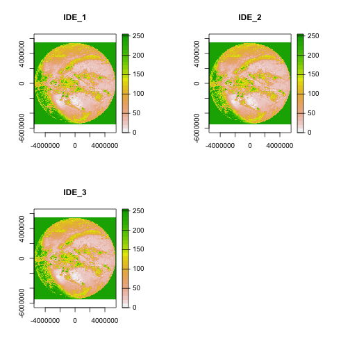
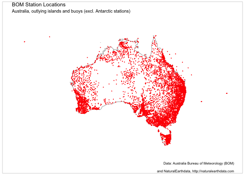
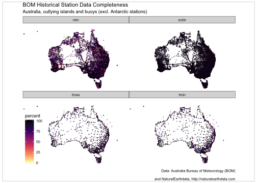
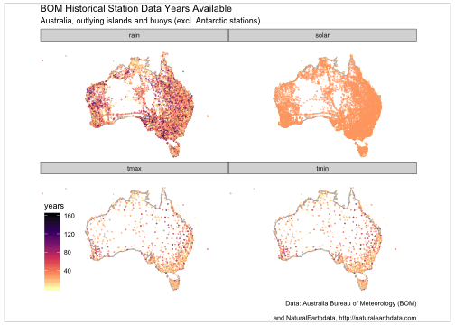

## Introduction

_bomrang_ provides functions for interacting with [Australian Bureau of Meteorology (BOM) Weather Data
Services](http://www.bom.gov.au/catalogue/data-feeds.shtml) forecasts.
BOM serves several types of data data as XML, JSON and SHTML files.
This package fetches these files, parses them and return a data frame.
Satellite and radar imagery files are also made available to the public via anonymous FTP.
_bomrang_ provides functionality to query, fetch and create `terra::SpatRaster()` objects of the GeoTIFF imagery or a magick object of radar image.png files.

## Using _bomrang_

Several functions are provided by _bomrang_ to retrieve Australian Bureau of Meteorology (BOM) data.
A family of functions retrieve weather data and return data frames; 
 * `get_precis_forecast()`, which retrieves the précis (short) forecast;
 * `get_current_weather()`, which fetches the current weather from a given station;
 * `get_ag_bulletin()`, which retrieves the agriculture bulletin;
 * `get_weather_bulletin()`, which fetches the 0900 and 1500 weather bulletins;
 * `get_coastal_forecast()`, which fetches coastal waters forecasts for each state; and
 * `get_historical()` which fetches historical daily temperature min/max, rainfall, or solar exposure data.
A second family of functions retrieve information pertaining to satellite and radar imagery, `get_available_imagery()` and the imagery itself, `_imagery()` for satellite, and
`get_available_radar()` and `get_radar_imagery()`  for radar images.
The last group functions provides internal functionality for _bomrang_ itself; `update_forecast_towns()`, which updates an internal database of forecast locations distributed with the package, `sweep_for_stations()` which returns the nearest weather stations to a point in Australia and, `manage_cache()` that provides facilities for managing cached satellite imagery.

## Using get_current_weather()

`get_current_weather()` takes one of two arguments: `station_name` and `latlon`, returning the current weather observations (and the observations of the last 72 hours) for the given location.

If `station_name` is used, the weather observations for the last 72 hours are returned for that station.
If the string provided is ambiguous, the function returns an observation for one of the possible stations and emits a warning to offer unambiguous station names. 

If `latlon` is used, the observations returned are from the station nearest to that latitude-longitude coordinate. `latlon` values are entered as decimal degrees, _e.g._ `latlon = c(-34, 151)` for Sydney.
The function also emits a message, to tell the user which station was used.

### Results

The table returned will have different fields depending on the station that is selected. 

### Example

Following is an example fetching the current weather for Melbourne.


```r
Melbourne_weather <- get_current_weather("Melbourne (Olympic Park)")
```

## Using get_precis_forecast()

This function only takes one argument, `state`. The `state` parameter allows the user to select the forecast for just one state or a national forecast.
States or territories are specified using the official postal codes or full name with fuzzy matching performed via `agrep()`.

- **ACT** - Australian Capital Territory

- **NSW** - New South Wales

- **NT** - Northern Territory

- **QLD** - Queensland

- **SA** - South Australia

- **TAS** - Tasmania

- **VIC** - Victoria

- **WA** - Western Australia

- **AUS** - Australia, returns national forecast including all states, NT and ACT.

### Results

The function, `get_precis_forecast()`, will return a data frame of the weather forecast for the daily forecast for selected towns.
See Appendix 1 for a full description of the fields and values.

### Example

Following is an example fetching the forecast for Queensland.


```r
(QLD_forecast <- get_precis_forecast(state = "QLD"))
#>      index product_id state         town       aac    lat
#>   1:     0   IDQ11295   QLD     Brisbane QLD_PT001 -27.48
#>   2:     1   IDQ11295   QLD     Brisbane QLD_PT001 -27.48
#>   3:     2   IDQ11295   QLD     Brisbane QLD_PT001 -27.48
#>   4:     3   IDQ11295   QLD     Brisbane QLD_PT001 -27.48
#>   5:     4   IDQ11295   QLD     Brisbane QLD_PT001 -27.48
#>  ---                                                     
#> 900:     3   IDQ11295   QLD Port Douglas QLD_PT254 -16.49
#> 901:     4   IDQ11295   QLD Port Douglas QLD_PT254 -16.49
#> 902:     5   IDQ11295   QLD Port Douglas QLD_PT254 -16.49
#> 903:     6   IDQ11295   QLD Port Douglas QLD_PT254 -16.49
#> 904:     7   IDQ11295   QLD Port Douglas QLD_PT254 -16.49
#>        lon elev    start_time_local end_time_local
#>   1: 153.0  8.1 2020-12-01 17:00:00     2020-12-02
#>   2: 153.0  8.1 2020-12-02 00:00:00     2020-12-03
#>   3: 153.0  8.1 2020-12-03 00:00:00     2020-12-04
#>   4: 153.0  8.1 2020-12-04 00:00:00     2020-12-05
#>   5: 153.0  8.1 2020-12-05 00:00:00     2020-12-06
#>  ---                                              
#> 900: 145.5 70.4 2020-12-04 00:00:00     2020-12-05
#> 901: 145.5 70.4 2020-12-05 00:00:00     2020-12-06
#> 902: 145.5 70.4 2020-12-06 00:00:00     2020-12-07
#> 903: 145.5 70.4 2020-12-07 00:00:00     2020-12-08
#> 904: 145.5 70.4 2020-12-08 00:00:00     2020-12-09
#>      utc_offset      start_time_utc        end_time_utc
#>   1:      10:00 2020-12-01 07:00:00 2020-12-01 14:00:00
#>   2:      10:00 2020-12-01 14:00:00 2020-12-02 14:00:00
#>   3:      10:00 2020-12-02 14:00:00 2020-12-03 14:00:00
#>   4:      10:00 2020-12-03 14:00:00 2020-12-04 14:00:00
#>   5:      10:00 2020-12-04 14:00:00 2020-12-05 14:00:00
#>  ---                                                   
#> 900:      10:00 2020-12-03 14:00:00 2020-12-04 14:00:00
#> 901:      10:00 2020-12-04 14:00:00 2020-12-05 14:00:00
#> 902:      10:00 2020-12-05 14:00:00 2020-12-06 14:00:00
#> 903:      10:00 2020-12-06 14:00:00 2020-12-07 14:00:00
#> 904:      10:00 2020-12-07 14:00:00 2020-12-08 14:00:00
#>      minimum_temperature maximum_temperature
#>   1:                  NA                  NA
#>   2:                  23                  34
#>   3:                  23                  29
#>   4:                  23                  32
#>   5:                  22                  32
#>  ---                                        
#> 900:                  24                  29
#> 901:                  24                  30
#> 902:                  24                  31
#> 903:                  25                  32
#> 904:                  25                  33
#>      lower_precipitation_limit upper_precipitation_limit
#>   1:                        NA                        NA
#>   2:                         0                       0.4
#>   3:                         0                       2.0
#>   4:                        NA                        NA
#>   5:                        NA                        NA
#>  ---                                                    
#> 900:                         0                       1.0
#> 901:                        NA                        NA
#> 902:                        NA                        NA
#> 903:                        NA                        NA
#> 904:                         0                       1.0
#>                precis probability_of_precipitation
#>   1:           Clear.                            0
#>   2:    Mostly sunny.                           30
#>   3: Possible shower.                           40
#>   4:   Partly cloudy.                           20
#>   5:           Sunny.                            5
#>  ---                                              
#> 900:    Mostly sunny.                           30
#> 901:    Mostly sunny.                           20
#> 902:    Mostly sunny.                           10
#> 903:   Partly cloudy.                           20
#> 904:   Partly cloudy.                           30
```


## Using get_ag_bulletin()

`get_ag_bulletin()` only takes one argument, `state`.
The `state` parameter allows the user to select the bulletin for just one state or a national forecast.
States or territories are specified using the official postal codes or full name with fuzzy matching performed via `agrep()`.

- **NSW** - New South Wales

- **NT** - Northern Territory

- **QLD** - Queensland

- **SA** - South Australia

- **TAS** - Tasmania

- **VIC** - Victoria

- **WA** - Western Australia

- **AUS** - Australia, returns bulletin for all states and NT.

### Results

The function, `get_ag_bulletin()`, will return a data frame of the agriculture bulletin for selected stations.
See Appendix 3 for a full list and description of the fields and values.

### Example

Following is an example fetching the ag bulletin for Queensland.


```r
(QLD_bulletin <- get_ag_bulletin(state = "QLD"))
#>     product_id state dist
#>  1:   IDQ60604   QLD   27
#>  2:   IDQ60604   QLD   29
#>  3:   IDQ60604   QLD   30
#>  4:   IDQ60604   QLD   31
#>  5:   IDQ60604   QLD   31
#>  6:   IDQ60604   QLD   31
#>  7:   IDQ60604   QLD   32
#>  8:   IDQ60604   QLD   32
#>  9:   IDQ60604   QLD   32
#> 10:   IDQ60604   QLD   33
#> 11:   IDQ60604   QLD   33
#> 12:   IDQ60604   QLD   35
#> 13:   IDQ60604   QLD   35
#> 14:   IDQ60604   QLD   36
#> 15:   IDQ60604   QLD   38
#> 16:   IDQ60604   QLD   38
#> 17:   IDQ60604   QLD   39
#> 18:   IDQ60604   QLD   39
#> 19:   IDQ60604   QLD   39
#> 20:   IDQ60604   QLD   40
#> 21:   IDQ60604   QLD   40
#> 22:   IDQ60604   QLD   40
#> 23:   IDQ60604   QLD   41
#> 24:   IDQ60604   QLD   41
#> 25:   IDQ60604   QLD   41
#> 26:   IDQ60604   QLD   43
#> 27:   IDQ60604   QLD   43
#> 28:   IDQ60604   QLD   43
#> 29:   IDQ60604   QLD   44
#> 30:   IDQ60604   QLD   45
#>     product_id state dist
#>                                 name   wmo  site
#>  1:                       WEIPA AERO 94170 27045
#>  2:                   MOUNT ISA AERO 94332 29127
#>  3:               GEORGETOWN AIRPORT 94274 30124
#>  4:                      CAIRNS AERO 94287 31011
#>  5:        WALKAMIN RESEARCH STATION 95284 31108
#>  6:                  MAREEBA AIRPORT 95286 31210
#>  7:          SOUTH JOHNSTONE EXP STN 95292 32037
#>  8:                  TOWNSVILLE AERO 94294 32040
#>  9:                 INGHAM COMPOSITE 95291 32078
#> 10:             AYR DPI RESEARCH STN 95295 33002
#> 11:                       MACKAY M.O 94367 33119
#> 12:                TAMBO POST OFFICE 94355 35069
#> 13:                  EMERALD AIRPORT 94363 35264
#> 14:                   LONGREACH AERO 94346 36031
#> 15:                   BOULIA AIRPORT 94333 38003
#> 16:               BIRDSVILLE AIRPORT 95482 38026
#> 17:                 ROCKHAMPTON AERO 94374 39083
#> 18:                 THANGOOL AIRPORT 94376 39089
#> 19:                   BUNDABERG AERO 94387 39128
#> 20:  UNIVERSITY OF QUEENSLAND GATTON 94562 40082
#> 21:                    BRISBANE AERO 94578 40842
#> 22: LOGAN CITY WATER TREATMENT PLANT 95581 40854
#> 23:                       OAKEY AERO 94552 41359
#> 24:                    DALBY AIRPORT 94542 41522
#> 25:                          WARWICK 94555 41525
#> 26:             MITCHELL POST OFFICE 94514 43020
#> 27:                     ROMA AIRPORT 94515 43091
#> 28:                ST GEORGE AIRPORT 94517 43109
#> 29:                 CHARLEVILLE AERO 94510 44021
#> 30:             THARGOMINDAH AIRPORT 95492 45025
#>                                 name   wmo  site
#>                  station      obs_time_local
#>  1:                Weipa 2020-12-01 09:00:00
#>  2:            Mount Isa 2020-12-01 09:00:00
#>  3:   Georgetown Airport 2020-12-01 09:00:00
#>  4:               Cairns 2020-12-01 09:00:00
#>  5:             Walkamin 2020-12-01 09:00:00
#>  6:              Mareeba 2020-12-01 09:00:00
#>  7:      South Johnstone 2020-12-01 09:00:00
#>  8:           Townsville 2020-12-01 09:00:00
#>  9:               Ingham 2020-12-01 09:00:00
#> 10:                  Ayr 2020-12-01 09:00:00
#> 11:               Mackay 2020-12-01 09:00:00
#> 12:                Tambo 2020-12-01 09:00:00
#> 13:              Emerald 2020-12-01 09:00:00
#> 14:            Longreach 2020-12-01 09:00:00
#> 15:               Boulia 2020-12-01 09:00:00
#> 16:           Birdsville 2020-12-01 09:00:00
#> 17:          Rockhampton 2020-12-01 09:00:00
#> 18:             Thangool 2020-12-01 09:00:00
#> 19:            Bundaberg 2020-12-01 09:00:00
#> 20:               Gatton 2020-12-01 09:00:00
#> 21:     Brisbane Airport 2020-12-01 09:00:00
#> 22:    Logan City (120)* 2020-12-01 09:00:00
#> 23:                Oakey 2020-12-01 09:00:00
#> 24:                Dalby 2020-12-01 09:00:00
#> 25:              Warwick 2020-12-01 09:00:00
#> 26:             Mitchell 2020-12-01 09:00:00
#> 27:                 Roma 2020-12-01 09:00:00
#> 28:            St George 2020-12-01 09:00:00
#> 29:          Charleville 2020-12-01 09:00:00
#> 30: Thargomindah Airport 2020-12-01 09:00:00
#>                  station      obs_time_local
#>            obs_time_utc time_zone    lat   lon  elev
#>  1: 2020-11-30 23:00:00       EST -12.68 141.9  18.0
#>  2: 2020-11-30 23:00:00       EST -20.68 139.5 340.3
#>  3: 2020-11-30 23:00:00       EST -18.30 143.5 301.8
#>  4: 2020-11-30 23:00:00       EST -16.87 145.7   2.2
#>  5: 2020-11-30 23:00:00       EST -17.13 145.4 594.0
#>  6: 2020-11-30 23:00:00       EST -17.07 145.4 471.9
#>  7: 2020-11-30 23:00:00       EST -17.61 146.0  18.3
#>  8: 2020-11-30 23:00:00       EST -19.25 146.8   4.3
#>  9: 2020-11-30 23:00:00       EST -18.65 146.2  11.8
#> 10: 2020-11-30 23:00:00       EST -19.62 147.4  17.0
#> 11: 2020-11-30 23:00:00       EST -21.12 149.2  30.3
#> 12: 2020-11-30 23:00:00       EST -24.88 146.3 395.1
#> 13: 2020-11-30 23:00:00       EST -23.57 148.2 189.4
#> 14: 2020-11-30 23:00:00       EST -23.44 144.3 192.2
#> 15: 2020-11-30 23:00:00       EST -22.91 139.9 161.8
#> 16: 2020-11-30 23:00:00       EST -25.90 139.3  46.6
#> 17: 2020-11-30 23:00:00       EST -23.38 150.5  10.4
#> 18: 2020-11-30 23:00:00       EST -24.49 150.6 193.1
#> 19: 2020-11-30 23:00:00       EST -24.91 152.3  30.8
#> 20: 2020-11-30 23:00:00       EST -27.54 152.3  89.0
#> 21: 2020-11-30 23:00:00       EST -27.39 153.1   4.5
#> 22: 2020-11-30 23:00:00       EST -27.68 153.2  14.0
#> 23: 2020-11-30 23:00:00       EST -27.40 151.7 405.7
#> 24: 2020-11-30 23:00:00       EST -27.16 151.3 343.9
#> 25: 2020-11-30 23:00:00       EST -28.21 152.1 475.4
#> 26: 2020-11-30 23:00:00       EST -26.49 148.0 336.5
#> 27: 2020-11-30 23:00:00       EST -26.55 148.8 307.4
#> 28: 2020-11-30 23:00:00       EST -28.05 148.6 198.5
#> 29: 2020-11-30 23:00:00       EST -26.41 146.3 301.6
#> 30: 2020-11-30 23:00:00       EST -27.99 143.8 130.9
#>            obs_time_utc time_zone    lat   lon  elev
#>     bar_ht start  end r   tn   tx  twd   ev   tg   sn
#>  1:   18.6  1972 2020 0 24.9 36.5  5.5   NA   NA   NA
#>  2:  341.0  1966 2020 0 26.2 42.1 12.6   NA   NA   NA
#>  3:  302.5  2004 2020 0 26.1 38.6  7.8   NA   NA   NA
#>  4:    2.6  1941 2020 0 23.3 32.2  5.6   NA   NA   NA
#>  5:     NA  1965 2020 0 19.5 32.4  3.7  5.2 19.0   NA
#>  6:  473.1  2000 2020 0 19.8 33.0  5.4   NA   NA   NA
#>  7:   18.6  1920 2020 0 21.4 30.3   NA   NA   NA   NA
#>  8:    4.6  1940 2020 0 21.7 31.9  7.0   NA   NA   NA
#>  9:   12.5  1968 2020 0 19.0 32.4  2.0   NA   NA   NA
#> 10:     NA  1951 2020 0 19.6 31.8   NA   NA   NA   NA
#> 11:   30.3  1959 2020 0 20.7 32.5  5.6   NA   NA   NA
#> 12:  397.4  1877 2020 0 26.1 40.8  9.5 12.0 18.5   NA
#> 13:  190.1  1981 2020 0 21.8 39.9  7.1   NA   NA   NA
#> 14:  192.5  1949 2020 0 23.1 41.8 12.7   NA   NA   NA
#> 15:  158.3  1886 2020 0 29.2   NA 10.9 20.0   NA   NA
#> 16:   47.0  2000 2020 0 31.6 47.1 15.8   NA   NA   NA
#> 17:   15.1  1939 2020 0 21.9 36.5  8.6   NA   NA   NA
#> 18:  193.8  1929 2020 0 20.0 39.0  7.3   NA   NA   NA
#> 19:   31.5  1942 2020 0 22.4 31.5  7.5   NA   NA   NA
#> 20:     NA  1897 2020 0 22.8 36.3   NA   NA   NA   NA
#> 21:    9.5  1992 2020 0 23.3 29.2  5.1   NA   NA 11.5
#> 22:     NA  1992 2020 0 22.9 30.6  3.7  0.0   NA   NA
#> 23:  407.1  1970 2020 0 21.1 38.1  6.4   NA   NA   NA
#> 24:  344.4  1992 2020 0 21.4 41.3  8.0   NA   NA   NA
#> 25:  475.8  1994 2020 0 19.8 36.2  6.4   NA   NA   NA
#> 26:  338.0  1884 2020 0 25.8 44.7 13.0   NA 24.1   NA
#> 27:  307.8  1985 2020 0 26.3 43.7 12.8   NA   NA   NA
#> 28:  199.1  1997 2020 0 29.1 45.1 13.9   NA   NA   NA
#> 29:  303.3  1942 2020 0 28.8 43.8 16.7   NA   NA   NA
#> 30:  131.4  1999 2020 0 32.8 46.2 21.1   NA   NA   NA
#>     bar_ht start  end r   tn   tx  twd   ev   tg   sn
#>     solr   t5  t10  t20  t50  t1m  wr
#>  1: 27.2   NA   NA   NA   NA   NA  NA
#>  2: 30.0   NA   NA   NA   NA   NA  NA
#>  3: 29.6   NA   NA   NA   NA   NA  NA
#>  4: 22.2   NA   NA   NA   NA   NA  NA
#>  5: 25.2   NA 29.0 30.0   NA   NA 157
#>  6: 28.7 33.4   NA 31.5   NA 31.2 127
#>  7: 19.8 27.5 27.4 27.9 28.0   NA  NA
#>  8: 29.3   NA   NA   NA   NA   NA  NA
#>  9: 26.5   NA   NA   NA   NA   NA  NA
#> 10: 29.4 35.8 31.7 31.7 33.0 30.4 108
#> 11: 29.9   NA   NA   NA   NA   NA  NA
#> 12: 30.6   NA   NA   NA   NA   NA  NA
#> 13: 30.3 38.8 33.9 33.0 33.3   NA  NA
#> 14: 30.6   NA 33.1 33.1 32.9 30.8  NA
#> 15: 30.6   NA   NA   NA   NA   NA  NA
#> 16: 30.5   NA   NA   NA   NA   NA  NA
#> 17: 30.4   NA   NA   NA   NA   NA  NA
#> 18: 30.5   NA   NA   NA   NA   NA  NA
#> 19: 30.1 29.5 29.6 29.9 29.9 28.7 222
#> 20: 30.4 40.9 29.5 29.4 28.4   NA 302
#> 21: 29.1 30.0 28.0 28.0 28.0 26.0 366
#> 22: 29.9   NA   NA   NA   NA   NA  NA
#> 23: 29.9   NA   NA   NA   NA   NA  NA
#> 24: 29.1 36.0   NA 29.4   NA 24.9 336
#> 25: 30.0 29.8 27.7 28.0 27.4 24.9 182
#> 26: 28.9   NA   NA   NA   NA   NA  NA
#> 27: 29.8 37.3 31.0 26.0 28.5 11.5  NA
#> 28: 29.2 41.6 36.3 35.2 34.2 31.4  NA
#> 29: 30.5   NA   NA   NA   NA   NA  NA
#> 30: 30.4   NA   NA   NA   NA   NA  NA
#>     solr   t5  t10  t20  t50  t1m  wr
```

## Using get_weather_bulletin()

This function takes two arguments, `state` for the desired state; and `morning` if `TRUE`, return the 9am bulletin for the nominated state; otherwise return the 3pm bulletin.
States or territories are specified using the official postal codes.

-   **ACT**  Australian Capital Territory (will return NSW)

-   **NSW** - New South Wales

-   **NT** - Northern Territory

-   **QLD** - Queensland

-   **SA** - South Australia

-   **TAS** - Tasmania

-   **VIC** - Victoria

-   **WA** - Western Australia

### Results

The function `get_weather_bulletin()` will return a data frame of BOM data for the requested state(s) or territory.

### Example

Following is an example fetching the 9AM bulletin for Queensland.


```r
(qld_weather <- get_weather_bulletin(state = "QLD", morning = TRUE))
#>            stations cld8ths wind_dir wind_speed_kmh
#>   1:     Coconut Is      NA     <NA>             NA
#>   2:        Coen Ap      NA        E             11
#>   3:        Horn Is       8      ESE             15
#>   4: Lockhart River       8       SE             24
#>   5:    Palmerville      NA      ENE              9
#>  ---                                               
#> 130:         Hobart      NA        N             26
#> 131:       Adelaide      NA        W             20
#> 132:       Perth Ap      NA        E              2
#> 133:         Darwin       5        N              2
#> 134:  Alice Springs       7       SE             11
#>      temp_c_dry temp_c_dew temp_c_max temp_c_min
#>   1:         NA         NA         NA         NA
#>   2:         30         22         35         23
#>   3:         29         25         33         27
#>   4:         29         24         32         27
#>   5:         30         20         37         23
#>  ---                                            
#> 130:         24         11         NA         NA
#> 131:         19         13         NA         NA
#> 132:         13          8         NA         NA
#> 133:         30         24         35         26
#> 134:         29         18         43         24
#>      temp_c_gr barhpa rain_mm weather seastate
#>   1:        NA     NA      NA    <NA>     <NA>
#>   2:        NA   1011      NA    <NA>     <NA>
#>   3:        NA   1011      NA    Rain     <NA>
#>   4:        NA   1011      NA    <NA>     <NA>
#>   5:        NA   1012      NA    <NA>     <NA>
#>  ---                                          
#> 130:        NA    996      NA    <NA>     <NA>
#> 131:        NA   1012      NA    <NA>     <NA>
#> 132:        NA   1025      NA    <NA>     <NA>
#> 133:        26   1009     0.4    <NA>     <NA>
#> 134:        NA   1011     8.0    <NA>     <NA>
```

Following is an example fetching the 3PM bulletin for Queensland.


```r
(qld_weather <- get_weather_bulletin(state = "QLD"))
#>            stations cld8ths wind_dir wind_speed_kmh
#>   1:     Coconut Is      NA     <NA>             NA
#>   2:        Coen Ap      NA        E             11
#>   3:        Horn Is       8      ESE             15
#>   4: Lockhart River       8       SE             24
#>   5:    Palmerville      NA      ENE              9
#>  ---                                               
#> 130:         Hobart      NA        N             26
#> 131:       Adelaide      NA        W             20
#> 132:       Perth Ap      NA        E              2
#> 133:         Darwin       5        N              2
#> 134:  Alice Springs       7       SE             11
#>      temp_c_dry temp_c_dew temp_c_max temp_c_min
#>   1:         NA         NA         NA         NA
#>   2:         30         22         35         23
#>   3:         29         25         33         27
#>   4:         29         24         32         27
#>   5:         30         20         37         23
#>  ---                                            
#> 130:         24         11         NA         NA
#> 131:         19         13         NA         NA
#> 132:         13          8         NA         NA
#> 133:         30         24         35         26
#> 134:         29         18         43         24
#>      temp_c_gr barhpa rain_mm weather seastate
#>   1:        NA     NA      NA    <NA>     <NA>
#>   2:        NA   1011      NA    <NA>     <NA>
#>   3:        NA   1011      NA    Rain     <NA>
#>   4:        NA   1011      NA    <NA>     <NA>
#>   5:        NA   1012      NA    <NA>     <NA>
#>  ---                                          
#> 130:        NA    996      NA    <NA>     <NA>
#> 131:        NA   1012      NA    <NA>     <NA>
#> 132:        NA   1025      NA    <NA>     <NA>
#> 133:        26   1009     0.4    <NA>     <NA>
#> 134:        NA   1011     8.0    <NA>     <NA>
```


## Using get_coastal_forecast()

This function only takes one argument, `state`.
The `state` parameter allows the user to select the forecast for just one state or a national forecast.
States or territories are specified using the official postal codes or full name with fuzzy matching performed via `agrep()`

- **ACT** - Australian Capital Territory

- **NSW** - New South Wales

- **NT** - Northern Territory

- **QLD** - Queensland

- **SA** - South Australia

- **TAS** - Tasmania

- **VIC** - Victoria

- **WA** - Western Australia

- **AUS** - Australia, returns national forecast including all states, NT and ACT.

### Results

The function, `get_coastal_forecast()`, will return a data frame of the coastal waters forecast for marine zones in each state.
See Appendix 6 for a full description of the fields and values.

### Example

Following is an example fetching the forecast for Queensland.


```r
(QLD_coastal_forecast <- get_coastal_forecast(state = "QLD"))
#>     index product_id    type state_code
#>  1:  <NA>   IDQ11290    <NA>        QLD
#>  2:  <NA>   IDQ11290    <NA>        QLD
#>  3:  <NA>   IDQ11290    <NA>        QLD
#>  4:  <NA>   IDQ11290    <NA>        QLD
#>  5:     0   IDQ11290    <NA>        QLD
#>  6:     1   IDQ11290    <NA>        QLD
#>  7:     2   IDQ11290    <NA>        QLD
#>  8:     3   IDQ11290    <NA>        QLD
#>  9:     0   IDQ11290    <NA>        QLD
#> 10:     1   IDQ11290    <NA>        QLD
#> 11:     2   IDQ11290    <NA>        QLD
#> 12:     3   IDQ11290    <NA>        QLD
#> 13:     0   IDQ11290 Coastal        QLD
#> 14:     1   IDQ11290 Coastal        QLD
#> 15:     2   IDQ11290 Coastal        QLD
#> 16:     3   IDQ11290 Coastal        QLD
#> 17:     0   IDQ11290    <NA>        QLD
#> 18:     1   IDQ11290    <NA>        QLD
#> 19:     2   IDQ11290    <NA>        QLD
#> 20:     3   IDQ11290    <NA>        QLD
#> 21:     0   IDQ11290    <NA>        QLD
#> 22:     1   IDQ11290    <NA>        QLD
#> 23:     2   IDQ11290    <NA>        QLD
#> 24:     3   IDQ11290    <NA>        QLD
#> 25:     0   IDQ11290    <NA>        QLD
#> 26:     1   IDQ11290    <NA>        QLD
#> 27:     2   IDQ11290    <NA>        QLD
#> 28:     3   IDQ11290    <NA>        QLD
#> 29:     0   IDQ11290    <NA>        QLD
#> 30:     1   IDQ11290    <NA>        QLD
#> 31:     2   IDQ11290    <NA>        QLD
#> 32:     3   IDQ11290    <NA>        QLD
#> 33:     0   IDQ11290    <NA>        QLD
#> 34:     1   IDQ11290    <NA>        QLD
#> 35:     2   IDQ11290    <NA>        QLD
#> 36:     3   IDQ11290    <NA>        QLD
#> 37:     0   IDQ11290    <NA>        QLD
#> 38:     1   IDQ11290    <NA>        QLD
#> 39:     2   IDQ11290    <NA>        QLD
#> 40:     3   IDQ11290    <NA>        QLD
#> 41:     0   IDQ11290   Local        QLD
#> 42:     1   IDQ11290   Local        QLD
#> 43:     2   IDQ11290   Local        QLD
#> 44:     3   IDQ11290   Local        QLD
#> 45:     0   IDQ11290    <NA>        QLD
#>                                                          dist_name
#>  1:                                                     Queensland
#>  2:                                 Queensland Gulf of Carpentaria
#>  3:                                               North Queensland
#>  4:                                               South Queensland
#>  5: South East Gulf of Carpentaria: QLD-NT Border to Cape Keerweer
#>  6: South East Gulf of Carpentaria: QLD-NT Border to Cape Keerweer
#>  7: South East Gulf of Carpentaria: QLD-NT Border to Cape Keerweer
#>  8: South East Gulf of Carpentaria: QLD-NT Border to Cape Keerweer
#>  9:   North East Gulf of Carpentaria: Cape Keerweer to Crab Island
#> 10:   North East Gulf of Carpentaria: Cape Keerweer to Crab Island
#> 11:   North East Gulf of Carpentaria: Cape Keerweer to Crab Island
#> 12:   North East Gulf of Carpentaria: Cape Keerweer to Crab Island
#> 13:                                                  Torres Strait
#> 14:                                                  Torres Strait
#> 15:                                                  Torres Strait
#> 16:                                                  Torres Strait
#> 17:                  Peninsula Coast: Sharp Point to Cape Melville
#> 18:                  Peninsula Coast: Sharp Point to Cape Melville
#> 19:                  Peninsula Coast: Sharp Point to Cape Melville
#> 20:                  Peninsula Coast: Sharp Point to Cape Melville
#> 21:              Cooktown Coast: Cape Melville to Cape Tribulation
#> 22:              Cooktown Coast: Cape Melville to Cape Tribulation
#> 23:              Cooktown Coast: Cape Melville to Cape Tribulation
#> 24:              Cooktown Coast: Cape Melville to Cape Tribulation
#> 25:                     Cairns Coast: Cape Tribulation to Cardwell
#> 26:                     Cairns Coast: Cape Tribulation to Cardwell
#> 27:                     Cairns Coast: Cape Tribulation to Cardwell
#> 28:                     Cairns Coast: Cape Tribulation to Cardwell
#> 29:                            Townsville Coast: Cardwell to Bowen
#> 30:                            Townsville Coast: Cardwell to Bowen
#> 31:                            Townsville Coast: Cardwell to Bowen
#> 32:                            Townsville Coast: Cardwell to Bowen
#> 33:                             Mackay Coast: Bowen to St Lawrence
#> 34:                             Mackay Coast: Bowen to St Lawrence
#> 35:                             Mackay Coast: Bowen to St Lawrence
#> 36:                             Mackay Coast: Bowen to St Lawrence
#> 37:                Capricornia Coast: St Lawrence to Burnett Heads
#> 38:                Capricornia Coast: St Lawrence to Burnett Heads
#> 39:                Capricornia Coast: St Lawrence to Burnett Heads
#> 40:                Capricornia Coast: St Lawrence to Burnett Heads
#> 41:                                                     Hervey Bay
#> 42:                                                     Hervey Bay
#> 43:                                                     Hervey Bay
#> 44:                                                     Hervey Bay
#> 45:         Fraser Island Coast: Sandy Cape to Double Island Point
#>     pt_1_name pt_2_name       aac    start_time_local
#>  1:      <NA>      <NA> QLD_FA001 2020-12-01 15:50:52
#>  2:      <NA>      <NA> QLD_FA002 2020-12-01 05:00:00
#>  3:      <NA>      <NA> QLD_FA003 2020-12-01 05:00:00
#>  4:      <NA>      <NA> QLD_FA004 2020-12-01 05:00:00
#>  5:      <NA>      <NA> QLD_MW001 2020-12-01 17:00:00
#>  6:      <NA>      <NA> QLD_MW001 2020-12-02 00:00:00
#>  7:      <NA>      <NA> QLD_MW001 2020-12-03 00:00:00
#>  8:      <NA>      <NA> QLD_MW001 2020-12-04 00:00:00
#>  9:      <NA>      <NA> QLD_MW002 2020-12-01 17:00:00
#> 10:      <NA>      <NA> QLD_MW002 2020-12-02 00:00:00
#> 11:      <NA>      <NA> QLD_MW002 2020-12-03 00:00:00
#> 12:      <NA>      <NA> QLD_MW002 2020-12-04 00:00:00
#> 13:      <NA>      <NA> QLD_MW003 2020-12-01 17:00:00
#> 14:      <NA>      <NA> QLD_MW003 2020-12-02 00:00:00
#> 15:      <NA>      <NA> QLD_MW003 2020-12-03 00:00:00
#> 16:      <NA>      <NA> QLD_MW003 2020-12-04 00:00:00
#> 17:      <NA>      <NA> QLD_MW004 2020-12-01 17:00:00
#> 18:      <NA>      <NA> QLD_MW004 2020-12-02 00:00:00
#> 19:      <NA>      <NA> QLD_MW004 2020-12-03 00:00:00
#> 20:      <NA>      <NA> QLD_MW004 2020-12-04 00:00:00
#> 21:      <NA>      <NA> QLD_MW005 2020-12-01 17:00:00
#> 22:      <NA>      <NA> QLD_MW005 2020-12-02 00:00:00
#> 23:      <NA>      <NA> QLD_MW005 2020-12-03 00:00:00
#> 24:      <NA>      <NA> QLD_MW005 2020-12-04 00:00:00
#> 25:      <NA>      <NA> QLD_MW006 2020-12-01 17:00:00
#> 26:      <NA>      <NA> QLD_MW006 2020-12-02 00:00:00
#> 27:      <NA>      <NA> QLD_MW006 2020-12-03 00:00:00
#> 28:      <NA>      <NA> QLD_MW006 2020-12-04 00:00:00
#> 29:      <NA>      <NA> QLD_MW007 2020-12-01 17:00:00
#> 30:      <NA>      <NA> QLD_MW007 2020-12-02 00:00:00
#> 31:      <NA>      <NA> QLD_MW007 2020-12-03 00:00:00
#> 32:      <NA>      <NA> QLD_MW007 2020-12-04 00:00:00
#> 33:      <NA>      <NA> QLD_MW008 2020-12-01 17:00:00
#> 34:      <NA>      <NA> QLD_MW008 2020-12-02 00:00:00
#> 35:      <NA>      <NA> QLD_MW008 2020-12-03 00:00:00
#> 36:      <NA>      <NA> QLD_MW008 2020-12-04 00:00:00
#> 37:      <NA>      <NA> QLD_MW009 2020-12-01 17:00:00
#> 38:      <NA>      <NA> QLD_MW009 2020-12-02 00:00:00
#> 39:      <NA>      <NA> QLD_MW009 2020-12-03 00:00:00
#> 40:      <NA>      <NA> QLD_MW009 2020-12-04 00:00:00
#> 41:      <NA>      <NA> QLD_MW010 2020-12-01 17:00:00
#> 42:      <NA>      <NA> QLD_MW010 2020-12-02 00:00:00
#> 43:      <NA>      <NA> QLD_MW010 2020-12-03 00:00:00
#> 44:      <NA>      <NA> QLD_MW010 2020-12-04 00:00:00
#> 45:      <NA>      <NA> QLD_MW011 2020-12-01 17:00:00
#>          end_time_local utc_offset      start_time_utc
#>  1: 2020-12-01 15:50:52      10:00 2020-12-01 15:50:52
#>  2: 2020-12-01 05:00:00      10:00 2020-12-01 05:00:00
#>  3: 2020-12-01 05:00:00      10:00 2020-12-01 05:00:00
#>  4: 2020-12-01 05:00:00      10:00 2020-12-01 05:00:00
#>  5: 2020-12-01 17:00:00      10:00 2020-12-01 17:00:00
#>  6: 2020-12-02 00:00:00      10:00 2020-12-02 00:00:00
#>  7: 2020-12-03 00:00:00      10:00 2020-12-03 00:00:00
#>  8: 2020-12-04 00:00:00      10:00 2020-12-04 00:00:00
#>  9: 2020-12-01 17:00:00      10:00 2020-12-01 17:00:00
#> 10: 2020-12-02 00:00:00      10:00 2020-12-02 00:00:00
#> 11: 2020-12-03 00:00:00      10:00 2020-12-03 00:00:00
#> 12: 2020-12-04 00:00:00      10:00 2020-12-04 00:00:00
#> 13: 2020-12-01 17:00:00      10:00 2020-12-01 17:00:00
#> 14: 2020-12-02 00:00:00      10:00 2020-12-02 00:00:00
#> 15: 2020-12-03 00:00:00      10:00 2020-12-03 00:00:00
#> 16: 2020-12-04 00:00:00      10:00 2020-12-04 00:00:00
#> 17: 2020-12-01 17:00:00      10:00 2020-12-01 17:00:00
#> 18: 2020-12-02 00:00:00      10:00 2020-12-02 00:00:00
#> 19: 2020-12-03 00:00:00      10:00 2020-12-03 00:00:00
#> 20: 2020-12-04 00:00:00      10:00 2020-12-04 00:00:00
#> 21: 2020-12-01 17:00:00      10:00 2020-12-01 17:00:00
#> 22: 2020-12-02 00:00:00      10:00 2020-12-02 00:00:00
#> 23: 2020-12-03 00:00:00      10:00 2020-12-03 00:00:00
#> 24: 2020-12-04 00:00:00      10:00 2020-12-04 00:00:00
#> 25: 2020-12-01 17:00:00      10:00 2020-12-01 17:00:00
#> 26: 2020-12-02 00:00:00      10:00 2020-12-02 00:00:00
#> 27: 2020-12-03 00:00:00      10:00 2020-12-03 00:00:00
#> 28: 2020-12-04 00:00:00      10:00 2020-12-04 00:00:00
#> 29: 2020-12-01 17:00:00      10:00 2020-12-01 17:00:00
#> 30: 2020-12-02 00:00:00      10:00 2020-12-02 00:00:00
#> 31: 2020-12-03 00:00:00      10:00 2020-12-03 00:00:00
#> 32: 2020-12-04 00:00:00      10:00 2020-12-04 00:00:00
#> 33: 2020-12-01 17:00:00      10:00 2020-12-01 17:00:00
#> 34: 2020-12-02 00:00:00      10:00 2020-12-02 00:00:00
#> 35: 2020-12-03 00:00:00      10:00 2020-12-03 00:00:00
#> 36: 2020-12-04 00:00:00      10:00 2020-12-04 00:00:00
#> 37: 2020-12-01 17:00:00      10:00 2020-12-01 17:00:00
#> 38: 2020-12-02 00:00:00      10:00 2020-12-02 00:00:00
#> 39: 2020-12-03 00:00:00      10:00 2020-12-03 00:00:00
#> 40: 2020-12-04 00:00:00      10:00 2020-12-04 00:00:00
#> 41: 2020-12-01 17:00:00      10:00 2020-12-01 17:00:00
#> 42: 2020-12-02 00:00:00      10:00 2020-12-02 00:00:00
#> 43: 2020-12-03 00:00:00      10:00 2020-12-03 00:00:00
#> 44: 2020-12-04 00:00:00      10:00 2020-12-04 00:00:00
#> 45: 2020-12-01 17:00:00      10:00 2020-12-01 17:00:00
#>            end_time_utc
#>  1: 2020-12-01 15:50:52
#>  2: 2020-12-01 05:00:00
#>  3: 2020-12-01 05:00:00
#>  4: 2020-12-01 05:00:00
#>  5: 2020-12-01 17:00:00
#>  6: 2020-12-02 00:00:00
#>  7: 2020-12-03 00:00:00
#>  8: 2020-12-04 00:00:00
#>  9: 2020-12-01 17:00:00
#> 10: 2020-12-02 00:00:00
#> 11: 2020-12-03 00:00:00
#> 12: 2020-12-04 00:00:00
#> 13: 2020-12-01 17:00:00
#> 14: 2020-12-02 00:00:00
#> 15: 2020-12-03 00:00:00
#> 16: 2020-12-04 00:00:00
#> 17: 2020-12-01 17:00:00
#> 18: 2020-12-02 00:00:00
#> 19: 2020-12-03 00:00:00
#> 20: 2020-12-04 00:00:00
#> 21: 2020-12-01 17:00:00
#> 22: 2020-12-02 00:00:00
#> 23: 2020-12-03 00:00:00
#> 24: 2020-12-04 00:00:00
#> 25: 2020-12-01 17:00:00
#> 26: 2020-12-02 00:00:00
#> 27: 2020-12-03 00:00:00
#> 28: 2020-12-04 00:00:00
#> 29: 2020-12-01 17:00:00
#> 30: 2020-12-02 00:00:00
#> 31: 2020-12-03 00:00:00
#> 32: 2020-12-04 00:00:00
#> 33: 2020-12-01 17:00:00
#> 34: 2020-12-02 00:00:00
#> 35: 2020-12-03 00:00:00
#> 36: 2020-12-04 00:00:00
#> 37: 2020-12-01 17:00:00
#> 38: 2020-12-02 00:00:00
#> 39: 2020-12-03 00:00:00
#> 40: 2020-12-04 00:00:00
#> 41: 2020-12-01 17:00:00
#> 42: 2020-12-02 00:00:00
#> 43: 2020-12-03 00:00:00
#> 44: 2020-12-04 00:00:00
#> 45: 2020-12-01 17:00:00
#>                                                                                                          forecast_seas
#>  1:                                                                                                               <NA>
#>  2:                                                                                                               <NA>
#>  3:                                                                                                               <NA>
#>  4:                                                                                                               <NA>
#>  5:                                                                                                     Below 1 metre.
#>  6:                                                                                                     Below 1 metre.
#>  7:                                        Around 1 metre, increasing to 1 to 1.5 metres inshore during the afternoon.
#>  8:                                                   Below 1 metre, increasing to 1 to 1.5 metres during the morning.
#>  9:                                                                                                     Below 1 metre.
#> 10:                                                                                                    Around 1 metre.
#> 11: Around 1 metre, increasing to 1 to 1.5 metres during the morning, then decreasing to 1 metre during the afternoon.
#> 12:                                      1 to 2 metres, decreasing to 1 to 1.5 metres during the afternoon or evening.
#> 13:                                                                                                    Around 1 metre.
#> 14:                                                                                                    Around 1 metre.
#> 15:                                                  Around 1 metre, increasing to 1 to 1.5 metres during the morning.
#> 16:                                                    1 to 1.5 metres, increasing to 1 to 2 metres west of Cape York.
#> 17:                                                    Around 1 metre, increasing to 1.5 to 2 metres outside the reef.
#> 18:                              1 to 1.5 metres, increasing to 1 to 2 metres south of Cape Sidmouth by early evening.
#> 19:                                                                                                     1 to 2 metres.
#> 20:                                                   1 to 1.5 metres, increasing to 1.5 to 2 metres outside the reef.
#> 21:                                                    Around 1 metre, increasing to 1 to 1.5 metres outside the reef.
#> 22:                                   1 to 1.5 metres, increasing to 1 to 2 metres north of Cooktown by early evening.
#> 23:                                                    Around 1 metre, increasing to 1.5 to 2 metres outside the reef.
#> 24:                                                    1 to 1.5 metres, increasing to 1 to 2 metres north of Cooktown.
#> 25:                                                                                                    Around 1 metre.
#> 26:                                  Below 1 metre, increasing to 1 to 1.5 metres outside the reef during the morning.
#> 27:                                                     Around 1 metre, increasing to 1 to 1.5 metres north of Cairns.
#> 28:                                                    Around 1 metre, increasing to 1 to 1.5 metres outside the reef.
#> 29:                                                                                                    Around 1 metre.
#> 30:                                                                                                    Around 1 metre.
#> 31:                                      Around 1 metre, increasing to 1 to 1.5 metres outside the reef around midday.
#> 32:                                                                                                    Around 1 metre.
#> 33:                                                                                                     Below 1 metre.
#> 34:                                                                                                     Below 1 metre.
#> 35:                                                                                                    Around 1 metre.
#> 36:                                                                                                     Below 1 metre.
#> 37:                                                                                                     Below 1 metre.
#> 38:                                                                                                    Around 1 metre.
#> 39:                                               Around 1 metre, increasing to 1 to 1.5 metres inshore around midday.
#> 40:                                                                                                    Around 1 metre.
#> 41:                                                                                                     Below 1 metre.
#> 42:                                                     Below 1 metre, increasing to 1 to 1.5 metres by early evening.
#> 43:                                                 Below 1 metre, increasing to 1 to 1.5 metres during the afternoon.
#> 44:                                      Below 1 metre, increasing to 1 to 1.5 metres during the afternoon or evening.
#> 45:                                                                                                     Below 1 metre.
#>                                                                          forecast_weather
#>  1:                                                                                  <NA>
#>  2:                                                                                  <NA>
#>  3:                                                                                  <NA>
#>  4:                                                                                  <NA>
#>  5:                        Mostly clear. The chance of a thunderstorm later this evening.
#>  6:                                           Mostly sunny. The chance of a thunderstorm.
#>  7:                                           Mostly sunny. The chance of a thunderstorm.
#>  8:                         The chance of a thunderstorm in the morning. Sunny afternoon.
#>  9:                   Partly cloudy. 50% chance of showers. The chance of a thunderstorm.
#> 10:                   Partly cloudy. 70% chance of showers. The chance of a thunderstorm.
#> 11:                                          Partly cloudy. The chance of a thunderstorm.
#> 12:                                          Partly cloudy. The chance of a thunderstorm.
#> 13:                                 Cloudy. 80% chance of showers. A thunderstorm likely.
#> 14:                   Partly cloudy. 90% chance of showers. The chance of a thunderstorm.
#> 15: Partly cloudy. 80% chance of showers. The chance of a thunderstorm west of Cape York.
#> 16:                   Partly cloudy. 60% chance of showers. The chance of a thunderstorm.
#> 17:                                                                      Possible shower.
#> 18:                                                 Partly cloudy. 60% chance of showers.
#> 19:                                                 Partly cloudy. 50% chance of showers.
#> 20:                                                                        Partly cloudy.
#> 21:                                                                        Partly cloudy.
#> 22:                                                 Partly cloudy. 50% chance of showers.
#> 23:                                                                        Partly cloudy.
#> 24:                                                                         Mostly sunny.
#> 25:                                                                        Partly cloudy.
#> 26:                                                                        Partly cloudy.
#> 27:                                                                        Partly cloudy.
#> 28:                                                                         Mostly sunny.
#> 29:                                                                         Mostly clear.
#> 30:                                                                         Mostly sunny.
#> 31:                                                                        Partly cloudy.
#> 32:                                                                         Mostly sunny.
#> 33:                                                                         Mostly clear.
#> 34:                                                                         Mostly sunny.
#> 35:                                                                        Partly cloudy.
#> 36:                                                                         Mostly sunny.
#> 37:                                                                                Clear.
#> 38:                                                                         Mostly sunny.
#> 39:                                                                        Partly cloudy.
#> 40:                                                                         Mostly sunny.
#> 41:                                                           Clear. Possible smoke haze.
#> 42:                                                             Mostly sunny. Smoke haze.
#> 43:                                                                        Partly cloudy.
#> 44:                                                                         Mostly sunny.
#> 45:                                                                           Smoke haze.
#>                                                                                                                                                                                                                                                       forecast_winds
#>  1:                                                                                                                                                                                                                                                             <NA>
#>  2:                                                                                                                                                                                                                                                             <NA>
#>  3:                                                                                                                                                                                                                                                             <NA>
#>  4:                                                                                                                                                                                                                                                             <NA>
#>  5:                                                                                                                                                                              North to northeasterly 10 to 15 knots tending west to northwesterly in the evening.
#>  6:                                                                                    Northwesterly 10 to 15 knots tending northeasterly around dawn. Winds becoming variable about 10 knots with inshore sea breezes up to 20 knots at times during the afternoon.
#>  7:                                                                                                                                      East to northeasterly 10 to 15 knots. Local inshore afternoon sea breezes 10 to 15 knots, reaching up to 20 knots at times.
#>  8:                                                                                                                     East to northeasterly 15 to 20 knots, easing to 10 to 15 knots in the middle of the day. Local inshore afternoon sea breezes 15 to 20 knots.
#>  9:                                                                                                                                                                  Variable about 10 knots becoming northeast to southeasterly 10 to 15 knots in the late evening.
#> 10:                                                                      Easterly 10 to 15 knots, reaching up to 20 knots at times after dawn. Winds becoming variable about 10 knots with inshore sea breezes up to 15 knots in the afternoon south of about Weipa.
#> 11:                                                                                                                                                                                     Easterly 15 to 20 knots. Local inshore afternoon sea breezes 10 to 15 knots.
#> 12:                                                                                                                                 Easterly 15 to 20 knots, reaching up to 25 knots offshore in the morning. Inshore afternoon sea breezes westerly 10 to 15 knots.
#> 13:                                                                                                                                                                         East to southeasterly 10 to 15 knots, reaching up to 20 knots at times in the afternoon.
#> 14:                                                                                                                                                                  East to southeasterly 10 to 15 knots, reaching up to 20 knots during the afternoon and evening.
#> 15:                                                                                                                                                                                                                            East to southeasterly 15 to 20 knots.
#> 16:                                                                                                                                                                                          East to southeasterly 15 to 20 knots, reaching up to 25 knots at times.
#> 17:                                                                                                                                  Southeasterly 15 to 20 knots. Inshore winds south of Port Stewart tending northeasterly during the afternoon and early evening.
#> 18:                                                                                                                                      Southeasterly 15 to 20 knots. Inshore winds south of Port Stewart turning northeasterly in the afternoon and early evening.
#> 19:                                                                                           Southeasterly 15 to 20 knots, reaching up to 25 knots at times. Inshore winds south of Point Stewart tending east to northeasterly in the afternoon and early evening.
#> 20:                                                                                    Southeasterly 20 to 25 knots, easing to 15 to 20 knots in the evening. Inshore winds south of Point Stewart tending east to northeasterly in the afternoon and early evening.
#> 21:                                                                                                                                                                                                                                    Southeasterly 15 to 20 knots.
#> 22:                                                                                                                                                                                                                                    Southeasterly 15 to 20 knots.
#> 23:                                                                                                                                                                                                                                    Southeasterly 15 to 20 knots.
#> 24:                                                                                                                                                                   East to southeasterly 15 to 20 knots, reaching up to 25 knots north of Cape Flattery at times.
#> 25:                                                                                                                                                                                                                                    Southeasterly 10 to 15 knots.
#> 26:                                                                                                                                                             East to southeasterly 15 to 20 knots. Inshore winds up to 10 knots lighter during the early morning.
#> 27:                                                                                                                                                             East to southeasterly 15 to 20 knots. Inshore winds up to 10 knots lighter during the early morning.
#> 28:                                                                                                                                                                    East to southeasterly 10 to 15 knots, reaching up to 20 knots north of Cape Grafton at times.
#> 29:                                                                                                                                East to southeasterly 10 to 15 knots, tending northeasterly inshore during the afternoon. Winds reaching up to 20 knots at times.
#> 30:                                                                                                East to southeasterly 10 to 15 knots, tending northeasterly around midday. Winds reaching up to 20 knots at times inshore during the afternoon and early evening.
#> 31:                                                                                                                  East to southeasterly 10 to 15 knot increasing to 15 to 20 knots in the middle of the day. East to northeasterly inshore afternoon sea breezes.
#> 32:                                                                                                                      East to southeasterly 10 to 15 knots. Inshore afternoon sea breezes east to northeasterly 10 to 15 knots, reaching up to 20 knots at times.
#> 33:                                                                                                                                                          Easterly 10 to 15 knots, reaching up to 20 knots offshore north of Hamilton Island in the late evening.
#> 34:                                                                                                                                                    East to northeasterly 10 to 15 knots, reaching up to 20 knots inshore during the afternoon and early evening.
#> 35:                                                                                                                                                        East to northeasterly 15 to 20 knots, reaching up to 25 knots inshore in the afternoon and early evening.
#> 36:                                                               East to southeasterly 10 to 15 knots tending east to northeasterly in the middle of the day. Inshore afternoon sea breezes east to northeasterly 10 to 15 knots, reaching up to 20 knots at times.
#> 37:                                                                                                                                                                                                                                    Northeasterly 10 to 15 knots.
#> 38:                                                                                                                                                            Northeasterly 10 to 15 knots, reaching up to 20 knots inshore during the afternoon and early evening.
#> 39:                                                                                                                                  East to northeasterly 10 to 15 knots. Inshore afternoon sea breezes reaching up to 20 knots in the afternoon and early evening.
#> 40:                                                              East to southeasterly 10 to 15 knots tending north to northeasterly in the middle of the day. Inshore afternoon sea breezes east to northeasterly 10 to 15 knots, reaching up to 20 knots at times.
#> 41:                                                                                                                                                                                                                           North to northeasterly 10 to 15 knots.
#> 42:                                                                                                                                                                 North to northeasterly 10 to 15 knots tending northeasterly 15 to 20 knots during the afternoon.
#> 43:                                                                                                                                                East to northeasterly 10 to 15 knots with sea breezes reaching up to 20 knots in the afternoon and early evening.
#> 44:                                                                                                                       East to southeasterly 10 to 15 knots tending north to northeasterly in the late morning and increasing to 15 to 20 knots in the afternoon.
#> 45:                                                                                                                                                                                                                           North to northeasterly 10 to 15 knots.
#>                                                                                      forecast_swell1
#>  1:                                                                                             <NA>
#>  2:                                                                                             <NA>
#>  3:                                                                                             <NA>
#>  4:                                                                                             <NA>
#>  5:                                                                                             <NA>
#>  6:                                                                                             <NA>
#>  7:                                                                                             <NA>
#>  8:                                                                                             <NA>
#>  9:                                                                                             <NA>
#> 10:                                                                                             <NA>
#> 11:                                                                                             <NA>
#> 12:                                                                                             <NA>
#> 13:                                                   Southeasterly around 1 metre outside the reef.
#> 14:                                                   Southeasterly around 1 metre outside the reef.
#> 15:        East to southeasterly around 1 metre, increasing to 1 to 1.5 metres later in the evening.
#> 16:             East to southeasterly below 1 metre, increasing to 1 to 1.5 metres outside the reef.
#> 17:                                                   Southeasterly around 1 metre outside the reef.
#> 18:                                                   Southeasterly around 1 metre outside the reef.
#> 19: Southeasterly around 1 metre outside the reef, increasing to 1 to 1.5 metres during the morning.
#> 20:                                          East to southeasterly 1 to 1.5 metres outside the reef.
#> 21:                                                             East to southeasterly below 1 metre.
#> 22:                                           East to southeasterly around 1 metre outside the reef.
#> 23:                                                       Easterly 1 to 1.5 metres outside the reef.
#> 24:                                                       Easterly 1 to 1.5 metres outside the reef.
#> 25:                                                             East to southeasterly below 1 metre.
#> 26:        Easterly around 1 metre outside the reef, increasing to 1 to 1.5 metres by early evening.
#> 27:      Easterly around 1 metre outside the reef, increasing to 1 to 1.5 metres during the morning.
#> 28:    Easterly around 1 metre outside the reef, increasing to 1 to 1.5 metres during the afternoon.
#> 29:                                                             East to northeasterly below 1 metre.
#> 30:                                                        Easterly around 1 metre outside the reef.
#> 31:                                                        Easterly around 1 metre outside the reef.
#> 32:                                                        Easterly around 1 metre outside the reef.
#> 33:                                                                                Below 0.5 metres.
#> 34:                                                                                Below 0.5 metres.
#> 35:                                                                                Below 0.5 metres.
#> 36:                                                                                Below 0.5 metres.
#> 37:                                               Southerly around 1 metre offshore southern waters.
#> 38:                                                                         Southerly below 1 metre.
#> 39:                                                            East to northeasterly around 1 metre.
#> 40:                                                            East to northeasterly around 1 metre.
#> 41:                                                            North to northeasterly below 1 metre.
#> 42:                                                            North to northeasterly below 1 metre.
#> 43:                                                            North to northeasterly below 1 metre.
#> 44:                                        North to northeasterly below 1 metre in the northern bay.
#> 45:                                                                        Southerly around 1 metre.
#>     forecast_swell2 forecast_caution marine_forecast
#>  1:            <NA>             <NA>            <NA>
#>  2:            <NA>             <NA>            <NA>
#>  3:            <NA>             <NA>            <NA>
#>  4:            <NA>             <NA>            <NA>
#>  5:            <NA>             <NA>            <NA>
#>  6:            <NA>             <NA>            <NA>
#>  7:            <NA>             <NA>            <NA>
#>  8:            <NA>             <NA>            <NA>
#>  9:            <NA>             <NA>            <NA>
#> 10:            <NA>             <NA>            <NA>
#> 11:            <NA>             <NA>            <NA>
#> 12:            <NA>             <NA>            <NA>
#> 13:            <NA>             <NA>            <NA>
#> 14:            <NA>             <NA>            <NA>
#> 15:            <NA>             <NA>            <NA>
#> 16:            <NA>             <NA>            <NA>
#> 17:            <NA>             <NA>            <NA>
#> 18:            <NA>             <NA>            <NA>
#> 19:            <NA>             <NA>            <NA>
#> 20:            <NA>             <NA>            <NA>
#> 21:            <NA>             <NA>            <NA>
#> 22:            <NA>             <NA>            <NA>
#> 23:            <NA>             <NA>            <NA>
#> 24:            <NA>             <NA>            <NA>
#> 25:            <NA>             <NA>            <NA>
#> 26:            <NA>             <NA>            <NA>
#> 27:            <NA>             <NA>            <NA>
#> 28:            <NA>             <NA>            <NA>
#> 29:            <NA>             <NA>            <NA>
#> 30:            <NA>             <NA>            <NA>
#> 31:            <NA>             <NA>            <NA>
#> 32:            <NA>             <NA>            <NA>
#> 33:            <NA>             <NA>            <NA>
#> 34:            <NA>             <NA>            <NA>
#> 35:            <NA>             <NA>            <NA>
#> 36:            <NA>             <NA>            <NA>
#> 37:            <NA>             <NA>            <NA>
#> 38:            <NA>             <NA>            <NA>
#> 39:            <NA>             <NA>            <NA>
#> 40:            <NA>             <NA>            <NA>
#> 41:            <NA>             <NA>            <NA>
#> 42:            <NA>             <NA>            <NA>
#> 43:            <NA>             <NA>            <NA>
#> 44:            <NA>             <NA>            <NA>
#> 45:            <NA>             <NA>            <NA>
#>     tropical_system_location forecast_waves
#>  1:                       NA             NA
#>  2:                       NA             NA
#>  3:                       NA             NA
#>  4:                       NA             NA
#>  5:                       NA             NA
#>  6:                       NA             NA
#>  7:                       NA             NA
#>  8:                       NA             NA
#>  9:                       NA             NA
#> 10:                       NA             NA
#> 11:                       NA             NA
#> 12:                       NA             NA
#> 13:                       NA             NA
#> 14:                       NA             NA
#> 15:                       NA             NA
#> 16:                       NA             NA
#> 17:                       NA             NA
#> 18:                       NA             NA
#> 19:                       NA             NA
#> 20:                       NA             NA
#> 21:                       NA             NA
#> 22:                       NA             NA
#> 23:                       NA             NA
#> 24:                       NA             NA
#> 25:                       NA             NA
#> 26:                       NA             NA
#> 27:                       NA             NA
#> 28:                       NA             NA
#> 29:                       NA             NA
#> 30:                       NA             NA
#> 31:                       NA             NA
#> 32:                       NA             NA
#> 33:                       NA             NA
#> 34:                       NA             NA
#> 35:                       NA             NA
#> 36:                       NA             NA
#> 37:                       NA             NA
#> 38:                       NA             NA
#> 39:                       NA             NA
#> 40:                       NA             NA
#> 41:                       NA             NA
#> 42:                       NA             NA
#> 43:                       NA             NA
#> 44:                       NA             NA
#> 45:                       NA             NA
#>  [ reached getOption("max.print") -- omitted 20 rows ]
```


## Using get_historical()

`get_historical()` takes either of two arguments: `stationid` and `latlon`, as well as a type of observation (`"rain"`, `"min"` (temperature), `"max"` (temperature), or `"solar"`), returning the historical daily weather observations of that type for the given location.
An optional fourth argument, `meta` returns a `list()` object of two data frames when set to `TRUE`.
The first table, `"meta"`, will include metadata on the station and data.
The second table, `"historical_data"`, will be as discussed in *Results* below.

If `latlon` is used, the observations returned are from the station nearest to that latitude-longitude coordinate.
`latlon` values are entered as decimal degrees, _e.g._ -34, 151 for Sydney.
The function also emits a message, to tell the user which station was used.

### Results

The table returned may have different fields depending on the station that is selected.
The time period over which observations are available will be highly dependent on the station requested.
Some stations may only have a decade or less of data (_e.g._ max temperature at `070351 (CANBERRA AIRPORT)` has ~3,700+ observations back to 2008) while others may have very extensive records (_e.g._
rainfall at `ADELAIDE (WEST TERRACE / NGAYIRDAPIRA)` has ~65,000+ observations back to 1839, three years after the city was founded.)

The optional metadata table will always have the following fields 
  
  - **site**: BOM station ID
  
  - **name**: BOM station name.
  
  - **lat**: Latitude in decimal degrees.
  
  - **lon**: Longitude in decimal degrees.
  
  - **start**: Date observations start.
  
  - **end**: Date observations end.
  
  - **years**: Available number of years data.
  
  - **percent**: Percent complete.
  
  - **AWS**: Automated weather station?
  
  - **type**: Measurement types available for the station.

### Example

Following is an example fetching the historical daily temperature minimum observations for the station closest to 35.2809°S, 149.1300°E (Canberra).


```r
(Canberra_mintemps <- get_historical(latlon = c(-35.2809, 149.1300),
                                     type = "min"))
#> 
#> Closest station: 070351 (CANBERRA AIRPORT)
#> Data saved as /var/folders/w7/y2cm1lcj4wn647m7zr3nvd500000gn/T//RtmpPZEc07/IDCJAC0011_070351_1800_Data.csv
#>   --- Australian Bureau of Meteorology (BOM) Data Resource ---
#>   (Original Request Parameters)
#>   Station:		CANBERRA AIRPORT [070351] 
#>   Location:		lat: -35.3088, lon: 149.2004
#>   Measurement / Origin:	Min / Historical
#>   Timespan:		2008-09-01 -- 2020-11-01 [12.3 years]
#>   ---------------------------------------------------------------  
#>       product_code station_number year month day
#>    1:   IDCJAC0011          70351 2008     1   1
#>    2:   IDCJAC0011          70351 2008     1   2
#>    3:   IDCJAC0011          70351 2008     1   3
#>    4:   IDCJAC0011          70351 2008     1   4
#>    5:   IDCJAC0011          70351 2008     1   5
#>   ---                                           
#> 4715:   IDCJAC0011          70351 2020    11  27
#> 4716:   IDCJAC0011          70351 2020    11  28
#> 4717:   IDCJAC0011          70351 2020    11  29
#> 4718:   IDCJAC0011          70351 2020    11  30
#> 4719:   IDCJAC0011          70351 2020    12   1
#>       min_temperature accum_days_min quality
#>    1:              NA             NA        
#>    2:              NA             NA        
#>    3:              NA             NA        
#>    4:              NA             NA        
#>    5:              NA             NA        
#>   ---                                       
#> 4715:            13.3              1       N
#> 4716:            14.9              1       N
#> 4717:            16.8              1       N
#> 4718:            13.6              1       N
#> 4719:            11.9              1       N
```


## Using sweep_for_stations()

`sweep_for_stations()` only takes one argument, `latlon`, a length-2 numeric vector.
By default, this is Canberra (approximately).

### Results

This function will search for weather stations and return a data frame of all weather stations (in this package) sorted by distance from `latlon`, ascending.
The fields in the data frame are:

**name** - station name

**lat** - latitude (decimal degrees)

**lon** - longitude (decimal degrees)

**distance** - distance from provided `latlon` value (kilometres).

### Example 1

Following is an example sweeping for stations starting with Canberra.


```r
# Show only the first ten stations in the list
head(sweep_for_stations(latlon = c(-35.3, 149.2)), 10)
#>       site dist                              name start
#>  1: 070351   70                  CANBERRA AIRPORT  2008
#>  2: 070339   70 TUGGERANONG (ISABELLA PLAINS) AWS  1996
#>  3: 070349   70                  MOUNT GININI AWS  2004
#>  4: 070341   70 CAPTAINS FLAT (COWANGERONG RADAR)  2002
#>  5: 069132   69          BRAIDWOOD RACECOURSE AWS  1985
#>  6: 073007   73                    BURRINJUCK DAM  1908
#>  7: 070330   70              GOULBURN AIRPORT AWS  1988
#>  8: 070263   70                     GOULBURN TAFE  1971
#>  9: 069128   69                       NERRIGA AWS  2013
#> 10: 069049   69                 NERRIGA COMPOSITE  1898
#>      end    lat   lon state  elev bar_ht   wmo state_code
#>  1: 2020 -35.31 149.2   ACT 577.1  577.6 94926       <NA>
#>  2: 2020 -35.42 149.1   ACT 586.7  587.5 94925       <NA>
#>  3: 2020 -35.53 148.8   ACT 760.0     NA 95925       <NA>
#>  4: 2020 -35.66 149.5   NSW 358.0     NA 99089          N
#>  5: 2020 -35.43 149.8   NSW 665.2  666.0 94927          N
#>  6: 2020 -35.00 148.6   NSW 390.0     NA 94909          N
#>  7: 2020 -34.81 149.7   NSW 640.0  640.8 95716          N
#>  8: 2020 -34.75 149.7   NSW 670.0     NA 94716          N
#>  9: 2020 -35.11 150.1   NSW 622.0  625.6 94943          N
#> 10: 2020 -35.12 150.1   NSW 630.0     NA 94942          N
#>                                                        url
#>  1: http://www.bom.gov.au/fwo/IDN60903/IDN60903.94926.json
#>  2: http://www.bom.gov.au/fwo/IDN60903/IDN60903.94925.json
#>  3: http://www.bom.gov.au/fwo/IDN60903/IDN60903.95925.json
#>  4: http://www.bom.gov.au/fwo/IDN60801/IDN60801.99089.json
#>  5: http://www.bom.gov.au/fwo/IDN60801/IDN60801.94927.json
#>  6: http://www.bom.gov.au/fwo/IDN60801/IDN60801.94909.json
#>  7: http://www.bom.gov.au/fwo/IDN60801/IDN60801.95716.json
#>  8: http://www.bom.gov.au/fwo/IDN60801/IDN60801.94716.json
#>  9: http://www.bom.gov.au/fwo/IDN60801/IDN60801.94943.json
#> 10: http://www.bom.gov.au/fwo/IDN60801/IDN60801.94942.json
#>     distance
#>  1:   0.9792
#>  2:  16.3173
#>  3:  46.4084
#>  4:  49.1327
#>  5:  54.7153
#>  6:  64.0835
#>  7:  72.9652
#>  8:  76.4731
#>  9:  82.9176
#> 10:  82.9269
```

## Using sweep_for_forecast_towns()

`sweep_for_forecast_towns()` only takes one argument, `latlon`, a length-2 numeric vector. By default, this is Canberra (approximately).

### Results

This function will search for weather stations and return a data frame of all weather stations (in this package) sorted by distance from `latlon`, ascending.
The fields in the data frame are:

**name** - forecast town

**lat** - latitude (decimal degrees)

**lon** - longitude (decimal degrees)

**distance** - distance from provided `latlon` value (kilometres).

### Example  

Following is an example sweeping for forecast towns starting with Canberra.


```r
# Show only the first ten towns in the list
head(sweep_for_forecast_towns(latlon = c(-35.3, 149.2)), 10)
#>           aac              town   lon    lat   elev
#>  1: NSW_PT027          Canberra 149.2 -35.31  577.6
#>  2: NSW_PT235        Queanbeyan 149.2 -35.35  612.0
#>  3: NSW_PT329 Portable RFSACT03 149.3 -35.31  719.0
#>  4: NSW_PT281      Woden Valley 149.1 -35.35  610.0
#>  5: NSW_PT254         Belconnen 149.1 -35.24  570.0
#>  6: NSW_PT267         Gungahlin 149.1 -35.18  621.5
#>  7: NSW_PT146       Tuggeranong 149.1 -35.42  586.7
#>  8: NSW_PT327 Portable RFSACT01 148.9 -35.46  834.0
#>  9: NSW_PT328 Portable RFSACT02 148.8 -35.11  749.0
#> 10: NSW_PT093      Mount Ginini 148.8 -35.53 1760.0
#>     distance
#>  1:   0.9789
#>  2:   6.2400
#>  3:  10.6165
#>  4:  11.7786
#>  5:  13.9971
#>  6:  14.0150
#>  7:  16.2500
#>  8:  30.2208
#>  9:  38.5023
#> 10:  46.3748
```

## Using the update functions

_bomrang_ uses internal databases of station location data from BOM to provide location and other metadata, _e.g._ elevation, station names, WMO codes, etc. to make the process of querying for weather data faster.
These databases are created and packaged with _bomrang_ for distribution and are updated with new releases.
Users have the option of updating these databases after installing _bomrang_.
While this option gives the users the ability to keep the databases up-to-date and gives _bomrang_'s authors flexibility in maintaining it, this also means that reproducibility may be affected since the same version of _bomrang_ may have different databases on different machines.
If reproducibility is necessary, care should be taken to ensure that the version of the databases is the same across different machines.

The databases consist of three files, used by _bomrang_, `AAC_codes.rda`, `JSONurl_latlon_by_station_name.rda` and `stations_site_list.rda`.
These files can be located on your local system by using the following command, 


```r
paste0(.libPaths(), "/bomrang/extdata")[1]
```

unless you have specified another location for library installations and installed _bomrang_ there, in which case it would still be in `bomrang/extdata`.

### Using update_forecast_towns()

`update_forecast_towns()` downloads the latest précis forecast locations from the BOM server and updates _bomrang_'s internal database of towns used for forecast locations.
This database is distributed with the package to make the process faster when fetching the forecast.

### Example

Following is an example updating the précis forecast locations internal database.


```r
update_forecast_towns()
```

### Using update_station_locations

`update_station_locations()` downloads the latest station locations and metadata and updates _bomrang_'s internal databases that support the use of `get_current_weather()` and `get_ag_bulletin()`.
There is no need to use this unless you know that a station exists in BOM's database that is not available in the databases distributed with _bomrang_.

### Example

Following is an example updating the précis forecast locations internal database.


```r
update_station_locations()
```

## Using _bomrang_ to retrieve satellite imagery

_bomrang_ provides functionality to retrieve high-definition GeoTIFF satellite imagery provided by BOM through public FTP with the following types of imagery being available: i.) [Infrared images](http://www.bom.gov.au/australia/satellite/about_images.shtml#ir), ii.)
[Visible images](http://www.bom.gov.au/australia/satellite/about_images.shtml#vis) and iii.) [Clouds/surface composite](http://www.bom.gov.au/australia/satellite/about_images.shtml#cloud).

Valid BOM satellite Product IDs for GeoTIFF files include:

<table>
<tr><th>Product ID</th><th>Description</th><th>Type</th><th>Delete time</th></tr>
<tr><td>IDE00420</td><td>AHI cloud cover only 2km FD GEOS </td><td>Satellite</td><td style= "text-align: center;">24</td></tr>
<tr><td>IDE00421</td><td>AHI IR (Ch13) greyscale 2km FD GEOS </td><td>Satellite</td><td style= "text-align: center;">24</td></tr>
<tr><td>IDE00422</td><td>AHI VIS (Ch3) greyscale 2km FD GEOS </td><td>Satellite</td><td style= "text-align: center;">24</td></tr>
<tr><td>IDE00423</td><td>AHI IR (Ch13) Zehr 2km FD GEOS </td><td>Satellite</td><td style= "text-align: center;">24</td></tr>
<tr><td>IDE00425</td><td>AHI VIS (true colour) / IR (Ch13 greyscale) composite 1km FD GEOS </td><td>Satellite</td><td style= "text-align: center;">24</td></tr>
<tr><td>IDE00426</td><td>AHI VIS (true colour) / IR (Ch13 greyscale) composite 2km FD GEOS </td><td>Satellite</td><td style= "text-align: center;">24</td></tr>
<tr><td>IDE00427</td><td>AHI WV (Ch8) 2km FD GEOS </td><td>Satellite</td><td style= "text-align: center;">24</td></tr>
<tr><td>IDE00430</td><td>AHI cloud cover only 2km AUS equirect. </td><td>Satellite</td><td style= "text-align: center;">24</td></tr>
<tr><td>IDE00431</td><td>AHI IR (Ch13) greyscale 2km AUS equirect. </td><td>Satellite</td><td style= "text-align: center;">24</td></tr>
<tr><td>IDE00432</td><td>AHI VIS (Ch3) greyscale 2km AUS equirect. </td><td>Satellite</td><td style= "text-align: center;">24</td></tr>
<tr><td>IDE00433</td><td>AHI IR (Ch13) Zehr 2km AUS equirect. </td><td>Satellite</td><td style= "text-align: center;">24</td></tr>
<tr><td>IDE00435</td><td>AHI VIS (true colour) / IR (Ch13 greyscale) composite 1km AUS equirect. </td><td>Satellite</td><td style= "text-align: center;">24</td></tr>
<tr><td>IDE00436</td><td>AHI VIS (true colour) / IR (Ch13 greyscale) composite 2km AUS equirect. </td><td>Satellite</td><td style= "text-align: center;">24</td></tr>
<tr><td>IDE00437</td><td>AHI WV (Ch8) 2km AUS equirect. </td><td>Satellite</td><td style= "text-align: center;">24</td></tr>
<tr><td>IDE00439</td><td>AHI VIS (Ch3) greyscale 0.5km AUS equirect. </td><td>Satellite</td><td style= "text-align: center;">24</td></tr>
<tr><td colspan = 3><strong>Information gathered from Australian Bureau of Meteorology (BOM)</strong></td></tr>
</table>

### Using get_available_imagery()

`get_available_imagery()` only takes one argument, `product_id`, a BOM identifier for the imagery that you wish to check for available imagery.
Using this function will fetch a listing of BOM GeoTIFF satellite imagery from [ftp://ftp.bom.gov.au/anon/gen/gms/](ftp://ftp.bom.gov.au/anon/gen/gms/) to display which files are currently available for download.
These files are available at ten minute update frequency with a 24 hour delete time.
This function can be used see the most recent files available and then specify in the `_imagery()` function.
If no valid Product ID is supplied, defaults to all GeoTIFF images currently available.


```r
(avail <- get_available_imagery(product_id = "IDE00425"))
#> 
#> The following files are currently available for download:
#>   [1] "IDE00425.202011301010.tif"
#>   [2] "IDE00425.202011301020.tif"
#>   [3] "IDE00425.202011301030.tif"
#>   [4] "IDE00425.202011301040.tif"
#>   [5] "IDE00425.202011301050.tif"
#>   [6] "IDE00425.202011301100.tif"
#>   [7] "IDE00425.202011301110.tif"
#>   [8] "IDE00425.202011301120.tif"
#>   [9] "IDE00425.202011301130.tif"
#>  [10] "IDE00425.202011301140.tif"
#>  [11] "IDE00425.202011301150.tif"
#>  [12] "IDE00425.202011301200.tif"
#>  [13] "IDE00425.202011301210.tif"
#>  [14] "IDE00425.202011301220.tif"
#>  [15] "IDE00425.202011301230.tif"
#>  [16] "IDE00425.202011301240.tif"
#>  [17] "IDE00425.202011301250.tif"
#>  [18] "IDE00425.202011301300.tif"
#>  [19] "IDE00425.202011301310.tif"
#>  [20] "IDE00425.202011301320.tif"
#>  [21] "IDE00425.202011301330.tif"
#>  [22] "IDE00425.202011301340.tif"
#>  [23] "IDE00425.202011301350.tif"
#>  [24] "IDE00425.202011301400.tif"
#>  [25] "IDE00425.202011301410.tif"
#>  [26] "IDE00425.202011301420.tif"
#>  [27] "IDE00425.202011301430.tif"
#>  [28] "IDE00425.202011301450.tif"
#>  [29] "IDE00425.202011301500.tif"
#>  [30] "IDE00425.202011301510.tif"
#>  [31] "IDE00425.202011301520.tif"
#>  [32] "IDE00425.202011301530.tif"
#>  [33] "IDE00425.202011301540.tif"
#>  [34] "IDE00425.202011301550.tif"
#>  [35] "IDE00425.202011301600.tif"
#>  [36] "IDE00425.202011301610.tif"
#>  [37] "IDE00425.202011301620.tif"
#>  [38] "IDE00425.202011301630.tif"
#>  [39] "IDE00425.202011301640.tif"
#>  [40] "IDE00425.202011301650.tif"
#>  [41] "IDE00425.202011301700.tif"
#>  [42] "IDE00425.202011301710.tif"
#>  [43] "IDE00425.202011301720.tif"
#>  [44] "IDE00425.202011301730.tif"
#>  [45] "IDE00425.202011301740.tif"
#>  [46] "IDE00425.202011301750.tif"
#>  [47] "IDE00425.202011301800.tif"
#>  [48] "IDE00425.202011301810.tif"
#>  [49] "IDE00425.202011301820.tif"
#>  [50] "IDE00425.202011301830.tif"
#>  [51] "IDE00425.202011301840.tif"
#>  [52] "IDE00425.202011301850.tif"
#>  [53] "IDE00425.202011301900.tif"
#>  [54] "IDE00425.202011301910.tif"
#>  [55] "IDE00425.202011301920.tif"
#>  [56] "IDE00425.202011301930.tif"
#>  [57] "IDE00425.202011301940.tif"
#>  [58] "IDE00425.202011301950.tif"
#>  [59] "IDE00425.202011302000.tif"
#>  [60] "IDE00425.202011302010.tif"
#>  [61] "IDE00425.202011302020.tif"
#>  [62] "IDE00425.202011302030.tif"
#>  [63] "IDE00425.202011302040.tif"
#>  [64] "IDE00425.202011302050.tif"
#>  [65] "IDE00425.202011302100.tif"
#>  [66] "IDE00425.202011302110.tif"
#>  [67] "IDE00425.202011302120.tif"
#>  [68] "IDE00425.202011302130.tif"
#>  [69] "IDE00425.202011302140.tif"
#>  [70] "IDE00425.202011302150.tif"
#>  [71] "IDE00425.202011302200.tif"
#>  [72] "IDE00425.202011302210.tif"
#>  [73] "IDE00425.202011302220.tif"
#>  [74] "IDE00425.202011302230.tif"
#>  [75] "IDE00425.202011302240.tif"
#>  [76] "IDE00425.202011302250.tif"
#>  [77] "IDE00425.202011302300.tif"
#>  [78] "IDE00425.202011302310.tif"
#>  [79] "IDE00425.202011302320.tif"
#>  [80] "IDE00425.202011302330.tif"
#>  [81] "IDE00425.202011302340.tif"
#>  [82] "IDE00425.202011302350.tif"
#>  [83] "IDE00425.202012010000.tif"
#>  [84] "IDE00425.202012010010.tif"
#>  [85] "IDE00425.202012010020.tif"
#>  [86] "IDE00425.202012010030.tif"
#>  [87] "IDE00425.202012010040.tif"
#>  [88] "IDE00425.202012010050.tif"
#>  [89] "IDE00425.202012010100.tif"
#>  [90] "IDE00425.202012010110.tif"
#>  [91] "IDE00425.202012010120.tif"
#>  [92] "IDE00425.202012010130.tif"
#>  [93] "IDE00425.202012010140.tif"
#>  [94] "IDE00425.202012010150.tif"
#>  [95] "IDE00425.202012010200.tif"
#>  [96] "IDE00425.202012010210.tif"
#>  [97] "IDE00425.202012010220.tif"
#>  [98] "IDE00425.202012010230.tif"
#>  [99] "IDE00425.202012010250.tif"
#> [100] "IDE00425.202012010300.tif"
#> [101] "IDE00425.202012010310.tif"
#> [102] "IDE00425.202012010320.tif"
#> [103] "IDE00425.202012010330.tif"
#> [104] "IDE00425.202012010340.tif"
#> [105] "IDE00425.202012010350.tif"
#> [106] "IDE00425.202012010400.tif"
#> [107] "IDE00425.202012010410.tif"
#> [108] "IDE00425.202012010420.tif"
#> [109] "IDE00425.202012010430.tif"
#> [110] "IDE00425.202012010440.tif"
#> [111] "IDE00425.202012010450.tif"
#> [112] "IDE00425.202012010500.tif"
#> [113] "IDE00425.202012010510.tif"
#> [114] "IDE00425.202012010520.tif"
#> [115] "IDE00425.202012010530.tif"
#> [116] "IDE00425.202012010540.tif"
#> [117] "IDE00425.202012010550.tif"
#> [118] "IDE00425.202012010600.tif"
#> [119] "IDE00425.202012010610.tif"
#> [120] "IDE00425.202012010620.tif"
#> [121] "IDE00425.202012010630.tif"
#> [122] "IDE00425.202012010640.tif"
#> [123] "IDE00425.202012010650.tif"
#> [124] "IDE00425.202012010700.tif"
#> [125] "IDE00425.202012010710.tif"
#> [126] "IDE00425.202012010720.tif"
#> [127] "IDE00425.202012010730.tif"
#> [128] "IDE00425.202012010740.tif"
#> [129] "IDE00425.202012010750.tif"
#> [130] "IDE00425.202012010800.tif"
#> [131] "IDE00425.202012010810.tif"
#> [132] "IDE00425.202012010820.tif"
#> [133] "IDE00425.202012010830.tif"
#> [134] "IDE00425.202012010840.tif"
#> [135] "IDE00425.202012010850.tif"
#> [136] "IDE00425.202012010900.tif"
#> [137] "IDE00425.202012010910.tif"
#> [138] "IDE00425.202012010920.tif"
#> [139] "IDE00425.202012010930.tif"
#> [140] "IDE00425.202012010940.tif"
#> [141] "IDE00425.202012010950.tif"
#> [142] "IDE00425.202012011000.tif"
#> [143] "IDE00425.202012011010.tif"
#>   [1] "IDE00425.202011301010.tif"
#>   [2] "IDE00425.202011301020.tif"
#>   [3] "IDE00425.202011301030.tif"
#>   [4] "IDE00425.202011301040.tif"
#>   [5] "IDE00425.202011301050.tif"
#>   [6] "IDE00425.202011301100.tif"
#>   [7] "IDE00425.202011301110.tif"
#>   [8] "IDE00425.202011301120.tif"
#>   [9] "IDE00425.202011301130.tif"
#>  [10] "IDE00425.202011301140.tif"
#>  [11] "IDE00425.202011301150.tif"
#>  [12] "IDE00425.202011301200.tif"
#>  [13] "IDE00425.202011301210.tif"
#>  [14] "IDE00425.202011301220.tif"
#>  [15] "IDE00425.202011301230.tif"
#>  [16] "IDE00425.202011301240.tif"
#>  [17] "IDE00425.202011301250.tif"
#>  [18] "IDE00425.202011301300.tif"
#>  [19] "IDE00425.202011301310.tif"
#>  [20] "IDE00425.202011301320.tif"
#>  [21] "IDE00425.202011301330.tif"
#>  [22] "IDE00425.202011301340.tif"
#>  [23] "IDE00425.202011301350.tif"
#>  [24] "IDE00425.202011301400.tif"
#>  [25] "IDE00425.202011301410.tif"
#>  [26] "IDE00425.202011301420.tif"
#>  [27] "IDE00425.202011301430.tif"
#>  [28] "IDE00425.202011301450.tif"
#>  [29] "IDE00425.202011301500.tif"
#>  [30] "IDE00425.202011301510.tif"
#>  [31] "IDE00425.202011301520.tif"
#>  [32] "IDE00425.202011301530.tif"
#>  [33] "IDE00425.202011301540.tif"
#>  [34] "IDE00425.202011301550.tif"
#>  [35] "IDE00425.202011301600.tif"
#>  [36] "IDE00425.202011301610.tif"
#>  [37] "IDE00425.202011301620.tif"
#>  [38] "IDE00425.202011301630.tif"
#>  [39] "IDE00425.202011301640.tif"
#>  [40] "IDE00425.202011301650.tif"
#>  [41] "IDE00425.202011301700.tif"
#>  [42] "IDE00425.202011301710.tif"
#>  [43] "IDE00425.202011301720.tif"
#>  [44] "IDE00425.202011301730.tif"
#>  [45] "IDE00425.202011301740.tif"
#>  [46] "IDE00425.202011301750.tif"
#>  [47] "IDE00425.202011301800.tif"
#>  [48] "IDE00425.202011301810.tif"
#>  [49] "IDE00425.202011301820.tif"
#>  [50] "IDE00425.202011301830.tif"
#>  [51] "IDE00425.202011301840.tif"
#>  [52] "IDE00425.202011301850.tif"
#>  [53] "IDE00425.202011301900.tif"
#>  [54] "IDE00425.202011301910.tif"
#>  [55] "IDE00425.202011301920.tif"
#>  [56] "IDE00425.202011301930.tif"
#>  [57] "IDE00425.202011301940.tif"
#>  [58] "IDE00425.202011301950.tif"
#>  [59] "IDE00425.202011302000.tif"
#>  [60] "IDE00425.202011302010.tif"
#>  [61] "IDE00425.202011302020.tif"
#>  [62] "IDE00425.202011302030.tif"
#>  [63] "IDE00425.202011302040.tif"
#>  [64] "IDE00425.202011302050.tif"
#>  [65] "IDE00425.202011302100.tif"
#>  [66] "IDE00425.202011302110.tif"
#>  [67] "IDE00425.202011302120.tif"
#>  [68] "IDE00425.202011302130.tif"
#>  [69] "IDE00425.202011302140.tif"
#>  [70] "IDE00425.202011302150.tif"
#>  [71] "IDE00425.202011302200.tif"
#>  [72] "IDE00425.202011302210.tif"
#>  [73] "IDE00425.202011302220.tif"
#>  [74] "IDE00425.202011302230.tif"
#>  [75] "IDE00425.202011302240.tif"
#>  [76] "IDE00425.202011302250.tif"
#>  [77] "IDE00425.202011302300.tif"
#>  [78] "IDE00425.202011302310.tif"
#>  [79] "IDE00425.202011302320.tif"
#>  [80] "IDE00425.202011302330.tif"
#>  [81] "IDE00425.202011302340.tif"
#>  [82] "IDE00425.202011302350.tif"
#>  [83] "IDE00425.202012010000.tif"
#>  [84] "IDE00425.202012010010.tif"
#>  [85] "IDE00425.202012010020.tif"
#>  [86] "IDE00425.202012010030.tif"
#>  [87] "IDE00425.202012010040.tif"
#>  [88] "IDE00425.202012010050.tif"
#>  [89] "IDE00425.202012010100.tif"
#>  [90] "IDE00425.202012010110.tif"
#>  [91] "IDE00425.202012010120.tif"
#>  [92] "IDE00425.202012010130.tif"
#>  [93] "IDE00425.202012010140.tif"
#>  [94] "IDE00425.202012010150.tif"
#>  [95] "IDE00425.202012010200.tif"
#>  [96] "IDE00425.202012010210.tif"
#>  [97] "IDE00425.202012010220.tif"
#>  [98] "IDE00425.202012010230.tif"
#>  [99] "IDE00425.202012010250.tif"
#> [100] "IDE00425.202012010300.tif"
#> [101] "IDE00425.202012010310.tif"
#> [102] "IDE00425.202012010320.tif"
#> [103] "IDE00425.202012010330.tif"
#> [104] "IDE00425.202012010340.tif"
#> [105] "IDE00425.202012010350.tif"
#> [106] "IDE00425.202012010400.tif"
#> [107] "IDE00425.202012010410.tif"
#> [108] "IDE00425.202012010420.tif"
#> [109] "IDE00425.202012010430.tif"
#> [110] "IDE00425.202012010440.tif"
#> [111] "IDE00425.202012010450.tif"
#> [112] "IDE00425.202012010500.tif"
#> [113] "IDE00425.202012010510.tif"
#> [114] "IDE00425.202012010520.tif"
#> [115] "IDE00425.202012010530.tif"
#> [116] "IDE00425.202012010540.tif"
#> [117] "IDE00425.202012010550.tif"
#> [118] "IDE00425.202012010600.tif"
#> [119] "IDE00425.202012010610.tif"
#> [120] "IDE00425.202012010620.tif"
#> [121] "IDE00425.202012010630.tif"
#> [122] "IDE00425.202012010640.tif"
#> [123] "IDE00425.202012010650.tif"
#> [124] "IDE00425.202012010700.tif"
#> [125] "IDE00425.202012010710.tif"
#> [126] "IDE00425.202012010720.tif"
#> [127] "IDE00425.202012010730.tif"
#> [128] "IDE00425.202012010740.tif"
#> [129] "IDE00425.202012010750.tif"
#> [130] "IDE00425.202012010800.tif"
#> [131] "IDE00425.202012010810.tif"
#> [132] "IDE00425.202012010820.tif"
#> [133] "IDE00425.202012010830.tif"
#> [134] "IDE00425.202012010840.tif"
#> [135] "IDE00425.202012010850.tif"
#> [136] "IDE00425.202012010900.tif"
#> [137] "IDE00425.202012010910.tif"
#> [138] "IDE00425.202012010920.tif"
#> [139] "IDE00425.202012010930.tif"
#> [140] "IDE00425.202012010940.tif"
#> [141] "IDE00425.202012010950.tif"
#> [142] "IDE00425.202012011000.tif"
#> [143] "IDE00425.202012011010.tif"
```

### Using get_satellite_imagery()

`get_satellite_imagery()` fetches BOM satellite GeoTIFF imagery, returning a SpatRaster object and takes three arguments.
Files are available at ten minute update frequency with a 24 hour delete time.
It is suggested to check file availability first by using `get_available_imagery()`.
The arguments are:

- `product_id`, a character value of the BOM product ID to download.
Alternatively, a vector of values from `get_available_imagery()` may be used here.
This argument is mandatory.

- `scans` a numeric value for the number of scans to download, starting with the most recent and progressing backwards, *e.g.*, `1` - the most recent single scan available , `6` - the most recent hour available, `12` - the most recent 2 hours available, etc.
Negating will return the oldest files first.
Defaults to 1.
This argument is optional.

- `cache` a logical value that indicates whether or not to store image files locally for later use?
If `FALSE`, the downloaded files are removed when R session is closed. To take advantage of cached files in future sessions, set `TRUE`.
Defaults to `FALSE`.
This argument is optional.
Cached files may be managed with the `manage_cache()` function.


```r
# Specify product ID and scans
i <- get_satellite_imagery(product_id = "IDE00425", scans = 1)

# Same, but use "avail" from prior to specify images for download
i <- get_satellite_imagery(product_id = avail, scans = 1)

# Cache image for later use
i <- get_satellite_imagery(product_id = avail, scans = 1, cache = TRUE)
```

`terra::plot()` has been re-exported to simplify visualising these files while using _bomrang_.


```r
plot(i)
```



## Using caching for satellite imagery

If you elect to use `cache = TRUE` when downloading imagery, note that the GTiff files can be quite large and will fill disk space.
By using the default `cache = FALSE` the files will be deleted when the current R session is closed.

Should you choose to use caching, _bomrang_ provided functions to interact with the cached files:

- List files in the cache, `manage_cache$list()`
  
    - List info for single files,
  
        - `manage_cache$list()[1])`
  
        - `manage_cache$list()[2])`

- List info for all files, `manage_cache$details()`

- Delete files by name in cache, `manage_cache$delete()`

- Delete all files in cache, `manage_cache$delete_all()`

To access the files directly, outside of R, the following command will give you the location of the directory:

`manage_cache$cache_path_get()`

## Using _bomrang_ to retrieve radar imagery

_bomrang_ provides functionality to retrieve the latest radar imagery provided by BOM through public FTP.
These are the latest snapshots for each radar locations at various radar ranges _e.g._, 512km, 256km, 128km and 64km for some stations.

### Using get_available_radar()

`get_available_radar()` fetches the available radar imagery from the BOM FTP and returns a data frame for reference.
This data frame contains the product_id, which is required when using the `get_radar_imagery()` function.
The files available are the latest `.png` files of BOM radar imagery which are typically updated each 6-10 minutes. Only the most recent image is retrieved for each radar location.
There are usually several radar ranges available for each radar location, such as 512km, 256km, 128km and possibly 64km.
The arguments are:

* `radar_id`  which is the BOM radar ID number; this defaults to 'all' which will return a data frame of all radar ID's in Australia.


```r
x <- get_available_radar()
head(x)  
#>   product_id LocationID range         Name Longitude
#> 1     IDR011         01 512km Broadmeadows     144.9
#> 2     IDR012         01 256km Broadmeadows     144.9
#> 3     IDR013         01 128km Broadmeadows     144.9
#> 4     IDR014         01  64km Broadmeadows     144.9
#> 5     IDR021         02 512km    Melbourne     144.8
#> 6     IDR022         02 256km    Melbourne     144.8
#>   Latitude Radar_id                Full_Name IDRnn0name
#> 1   -37.69        1 Melbourne (Broadmeadows)     CampRd
#> 2   -37.69        1 Melbourne (Broadmeadows)     CampRd
#> 3   -37.69        1 Melbourne (Broadmeadows)     CampRd
#> 4   -37.69        1 Melbourne (Broadmeadows)     CampRd
#> 5   -37.86        2     Melbourne (Laverton)       Melb
#> 6   -37.86        2     Melbourne (Laverton)       Melb
#>   IDRnn1name State    Type Group    Status Archive
#> 1     CampRd   VIC Doppler   Yes Reg_users  CampRd
#> 2     CampRd   VIC Doppler   Yes Reg_users  CampRd
#> 3     CampRd   VIC Doppler   Yes Reg_users  CampRd
#> 4     CampRd   VIC Doppler   Yes Reg_users  CampRd
#> 5  Melbourne   VIC Doppler   Yes    Public    Melb
#> 6  Melbourne   VIC Doppler   Yes    Public    Melb
```

### Using get_radar_imagery()

`get_radar_imagery()` fetches the latest BOM radar imagery for a given product ID.
The files available are the latest `.png` files of BOM radar imagery, which are typically updated each 6-10 minutes.
Only the most recent image is retrieved for each radar location.
There are usually several radar ranges available for each radar location, such as 512km, 256km, 128km and possibly 64km.
The only argument is:

* `product_id` the BOM product_id associated with each radar imagery file.
These can be obtained from the `get_available_radar()` function.
This value must be specified and the function will accept only one at a time.


```r
(get_radar_imagery(product_id = "IDR032"))
#> file downloaded to:/var/folders/w7/y2cm1lcj4wn647m7zr3nvd500000gn/T//RtmpPZEc07/file5d6e68bf0bb6.png
```


# dplyr compatibility

Some returned objects have been classed as `bomrang_tbl` which allow dispatch for dplyr methods, _e.g._ `mutate()`, `filter()`, `select()`, `arrange()`, `slice()`, `rename()`, and `group_by()` while preserving the header information.

For example:


```r
adlmax <- get_historical(stationid = "023000", type = "max")
#> Data saved as /var/folders/w7/y2cm1lcj4wn647m7zr3nvd500000gn/T//RtmpPZEc07/IDCJAC0010_023000_1800_Data.csv
adlmax
#>   --- Australian Bureau of Meteorology (BOM) Data Resource ---
#>   (Original Request Parameters)
#>   Station:		ADELAIDE (WEST TERRACE / NGAYIRDAPIRA) [023000] 
#>   Location:		lat: -34.9257, lon: 138.5832
#>   Measurement / Origin:	Max / Historical
#>   Timespan:		1887-01-01 -- 2020-11-01 [95.7 years]
#>   ---------------------------------------------------------------  
#>        product_code station_number year month day
#>     1:   IDCJAC0010          23000 1887     1   1
#>     2:   IDCJAC0010          23000 1887     1   2
#>     3:   IDCJAC0010          23000 1887     1   3
#>     4:   IDCJAC0010          23000 1887     1   4
#>     5:   IDCJAC0010          23000 1887     1   5
#>    ---                                           
#> 48908:   IDCJAC0010          23000 2020    11  26
#> 48909:   IDCJAC0010          23000 2020    11  27
#> 48910:   IDCJAC0010          23000 2020    11  28
#> 48911:   IDCJAC0010          23000 2020    11  29
#> 48912:   IDCJAC0010          23000 2020    11  30
#>        max_temperature accum_days_max quality
#>     1:              NA             NA        
#>     2:              NA             NA        
#>     3:              NA             NA        
#>     4:              NA             NA        
#>     5:              NA             NA        
#>    ---                                       
#> 48908:            33.0              1       N
#> 48909:            40.6              1       N
#> 48910:            33.3              1       N
#> 48911:            23.5              1       N
#> 48912:            32.1              1       N

filter(adlmax, month == 10)
#>   --- Australian Bureau of Meteorology (BOM) Data Resource ---
#>   (Original Request Parameters)
#>   Station:		ADELAIDE (WEST TERRACE / NGAYIRDAPIRA) [023000] 
#>   Location:		lat: -34.9257, lon: 138.5832
#>   Measurement / Origin:	Max / Historical
#>   Timespan:		1887-01-01 -- 2020-11-01 [95.7 years]
#>   ---------------------------------------------------------------  
#>       product_code station_number year month day
#>    1:   IDCJAC0010          23000 1887    10   1
#>    2:   IDCJAC0010          23000 1887    10   2
#>    3:   IDCJAC0010          23000 1887    10   3
#>    4:   IDCJAC0010          23000 1887    10   4
#>    5:   IDCJAC0010          23000 1887    10   5
#>   ---                                           
#> 4150:   IDCJAC0010          23000 2020    10  27
#> 4151:   IDCJAC0010          23000 2020    10  28
#> 4152:   IDCJAC0010          23000 2020    10  29
#> 4153:   IDCJAC0010          23000 2020    10  30
#> 4154:   IDCJAC0010          23000 2020    10  31
#>       max_temperature accum_days_max quality
#>    1:            17.6              1       Y
#>    2:            14.6              1       Y
#>    3:            16.7              1       Y
#>    4:            18.0              1       Y
#>    5:            15.1              1       Y
#>   ---                                       
#> 4150:            21.4              1       Y
#> 4151:            23.3              1       Y
#> 4152:            20.9              1       Y
#> 4153:            18.6              1       Y
#> 4154:            18.2              1       Y
```

The `magrittr` pipe has also been re-exported, so that too can be used to chain together operations


```r
adlmax %>% 
  select(station_number, year:day, max_temperature) %>% 
  filter(month == 10)
#>   --- Australian Bureau of Meteorology (BOM) Data Resource ---
#>   (Original Request Parameters)
#>   Station:		ADELAIDE (WEST TERRACE / NGAYIRDAPIRA) [023000] 
#>   Location:		lat: -34.9257, lon: 138.5832
#>   Measurement / Origin:	Max / Historical
#>   Timespan:		1887-01-01 -- 2020-11-01 [95.7 years]
#>   ---------------------------------------------------------------  
#>       station_number year month day max_temperature
#>    1:          23000 1887    10   1            17.6
#>    2:          23000 1887    10   2            14.6
#>    3:          23000 1887    10   3            16.7
#>    4:          23000 1887    10   4            18.0
#>    5:          23000 1887    10   5            15.1
#>   ---                                              
#> 4150:          23000 2020    10  27            21.4
#> 4151:          23000 2020    10  28            23.3
#> 4152:          23000 2020    10  29            20.9
#> 4153:          23000 2020    10  30            18.6
#> 4154:          23000 2020    10  31            18.2
```

## References

[Australian Bureau of Meteorology (BOM) Weather Data Services](http://www.bom.gov.au/catalogue/data-feeds.shtml)

[Australian Bureau of Meteorology (BOM) FTP Public Products](http://www.bom.gov.au/catalogue/anon-ftp.shtml)

[Australian Bureau of Meteorology (BOM) Weather Data Services Agriculture Bulletins](http://www.bom.gov.au/catalogue/observations/about-agricultural.shtml)

[Australian Bureau of Meteorology (BOM) Weather Data Services Observation of Rainfall](http://www.bom.gov.au/climate/how/observations/rain-measure.shtml)

[Australian Bureau of Meteorology (BOM) High-definition satellite images](http://www.bom.gov.au/australia/satellite/index.shtml)

## Appendix 1 - Output from get_current_weather()

The function `get_current_weather()` will return a data frame that will contain some or all of the following fields.

### Fields and descriptions

<table>
<tr><th>Field Name</th><th>Description</th></tr>
<tr><td>wmo_id</td><td>wmo station index number, uniquely identifies
station</td></tr>
<tr><td>Name[31]</td><td>Observing station name</td></tr>
<tr><td>Abbr[6]</td><td>An abbreviated name (normally 4 characters) used for the
station</td></tr>
<tr><td>Date</td><td>Date, Year (4 digits), month (2 digits), day (2
digits)</td></tr>
<tr><td>Time</td><td>Time, Hours (2 digits), minutes (2 digits), UTC</td></tr>
<tr><td>Lat</td><td>Latitude, decimal degrees, S -ve, N +ve</td></tr>
<tr><td>Lon</td><td>Longitude, decimal degrees, E +ve, W -ve</td></tr>
<tr><td>Stn_typ</td><td>Station type</td></tr>
<tr><td>Stn_ht_m</td><td>Station height (in metres)</td></tr>
<tr><td>Total_cld</td><td>Total cloud cover in oktas, 9=Sky Obscured by smoke,
fog, ...</td></tr>
<tr><td>Wdir</td><td>Wind direction, degrees true</td></tr>
<tr><td>Wspd_mps</td><td>Wind speed, metres per second</td></tr>
<tr><td>Vis_m</td><td>Visibility, metres</td></tr>
<tr><td>Wx[9]</td><td>Present weather, abbreviated</td></tr>
<tr><td>Pw1</td><td>Past weather (last 3-6 hours), see below</td></tr>
<tr><td>Pw2</td><td>Past weather (Used so more than one variation can be
reported)</td></tr>
<tr><td>Msl_P</td><td>Mean Sea Level Pressure, hPa</td></tr>
<tr><td>Stn_P</td><td>Station level pressure, hPa</td></tr>
<tr><td>P_tend_typ</td><td>Type of the pressure tendency, numerical code, see
below</td></tr>
<tr><td>P_tend_val</td><td>Pressure tendency (change) in last 3 hours,
hPa</td></tr>
<tr><td>Cor_P_tend</td><td>Pressure tendency in last 3 hours corrected for
diurnal variation</td></tr>
<tr><td>T_DB</td><td>Temperature (dry bulb), degrees C</td></tr>
<tr><td>DP</td><td>Dew point, degrees C</td></tr>
<tr><td>Low_cld_amt</td><td>Amount of low cloud, oktas, 9=Sky obscured by fog,
smoke, ...</td></tr>
<tr><td>Low_cld_typ[4]</td><td>Type of low cloud, abbreviation</td></tr>
<tr><td>Cld_base_m</td><td>Base of lowest cloud, m</td></tr>
<tr><td>Cld_dir[4]</td><td>Direction of motion of low cloud, compass
point</td></tr>
<tr><td>Mid_cld_typ[4]</td><td>Type of middle level cloud, abbreviation</td></tr>
<tr><td>Hi_cld_typ[4]</td><td>Type of high cloud, abbreviation</td></tr>
<tr><td>Rf_int_h6</td><td>Interval for which rain is reported in next field,
hours</td></tr>
<tr><td>Rainfall6</td><td>Rainfall, mm, usually at 9 or 3 AM/PM</td></tr>
<tr><td>Rf_int_h4</td><td>Interval for which rain is reported in next field,
hours</td></tr>
<tr><td>Rainfall4</td><td>Rainfall, mm, usually since last
observation</td></tr>
<tr><td>Sea_state[5]</td><td>Sea state, abbreviation</td></tr>
<tr><td>Swl_state[9]</td><td>Swell state, abbreviation</td></tr>
<tr><td>Swl_dir[4]</td><td>Swell direction, abbreviation</td></tr>
<tr><td>Max_T</td><td>Maximum temperature, 24h to 9AM or 6h to 3PM local time,
degree C</td></tr>
<tr><td>Min_T</td><td>Minimum temperature, 24h to 9AM local time, degree
C</td></tr>
<tr><td>Min_grnd_T</td><td>Minimum ground temperature, 24 h to (AM local time,
degree C</td></tr>
<tr><td>Snow_depth_m</td><td>Depth of snow on ground, metres</td></tr>
<tr><td>Low_cld_code</td><td>Code for low level cloud type, see below</td></tr>
<tr><td>Mid_cld_code</td><td>Code for middle level cloud type, see
below</td></tr>
<tr><td>Hi_cld_code</td><td>Code for high level cloud type, see below</td></tr>
<tr><td>Max_T(Int)</td><td>Maximum temperature for international
exchange</td></tr>
<tr><td>Min_T(Int)</td><td>Minimum temperature for international
exchange</td></tr>
<tr><td>Plain_lang[51]</td><td>Plain language comments</td></tr>
</table>

### Codes:

P_tend_typ:

- 0 Increasing, then decreasing, current pressure same or higher  
- 1 Increasing, then steady or increasing more slowly  
- 2 Increasing  
- 3 Decreasing or steady, then increasing, or  
  - Increasing, then increasing more rapidly, current pressure higher  
- 4 Steady  
- 5 Decreasing, then increasing, current pressure lower  
- 6 Decreasing, then steady or decreasing more slowly  
- 7 Decreasing  
-8 Steady or increasing, then then decreasing, current pressure lower, or  
  - Decreasing, then decreasing more rapidly  

### Wx[9] - Present weather

This consists of a two or 3 digit code figure plus (when relevant) a short, text abbreviation of the weather The abbreviations used (frequently  together, _e.g._, XXRA for heavy rain, FZDZ for freezing drizzle) include:

- BL Blowing (usually of sand or snow)  
- DR Drifting (usually of sand or snow)  
- DZ Drizzle  
- FC Funnel cloud (tornado, water spout)  
- FG Fog  
- FU Smoke    (from the French for smoke)  
- FZ Freezing (usually of rain or fog)  
- GR Hail     (from the French for hail)  
- HZ Haze  
- MI Shallow (can be applied to Fog etc)  
- RE Ice pellets  
- PO Dust devils  
- RA Rain  
- RE Recent (in the last hour, but not at the observation time)  
- SA Sand  
- SG Snow grains  
- SH Showers  
- SN Snow  
- SQ Squall  
- TS Thunderstorm  
- XX Heavy or intense (usually of rain or snow)  

Also, some other abbreviations used include

- lightn  Lightning  
- virga   Virga  
- RIA<5k  Precipitation in the area, less then 5km distant  

### Code figures

(This is a subset of a larger table, not all values of which are used) wmo international BUFR code table 0 20 003, CREX code table B 20 003:

	 00 Clouds not observed
	 01 Cloud decreasing
	 02 State of sky generally unchanging
	 03 Cloud increasing
	 04 Smoke or volcanic ash
	 05 Haze
	 06 Widespread dust suspended in the air, not raised locally at the time of observation
	 07 Dust or sand raised locally by the wind at the time of observation, but no well developed dust devils, sandstorm, or duststorm
	 08 Well developed dust devils, but no sandstorm or duststorm
	 09 Duststorm or sandstorm
	 10 Mist
	 11 Patches of shallow fog
	 12 More or less continuous shallow fog
	 13 Lightning visible, but no thunder heard
	 14 Precipitation in sight, but not reaching the ground or sea (virga)
	 15 Precipitation in sight, reaching the ground, but more than 5km away
	 16 Precipitation in sight, reaching the ground, near but not at the observing station
	 17 Thunderstorm without precipitation
	 18 Squalls
	 19 Funnel clouds (tornado, water spout)
	 20 Recent (within the last hour) drizzle
	 21 Recent (within the last hour) rain, but not freezing rain
	 22 Recent (within the last hour) snow
	 23 Recent (within the last hour) mixed rain and snow or ice pellets
	 24 Recent (within the last hour) freezing drizzle or freezing rain
	 25 Recent (within the last hour) showers of rain
	 26 Recent (within the last hour) showers of snow or mixed rain and snow
	 27 Recent (within the last hour) showers of hail or mixed rain and hail
	 28 Recent (within the last hour) Fog or ice fog
	 29 Recent (within the last hour) thunderstorm
	 30 Slight or moderate duststorm or sandstorm, has decreased in the last hour
	 31 Slight or moderate duststorm or sandstorm, with no appreciable change in the last hour
	 32 Slight or moderate duststorm or sandstorm, has begun or increased in the last hour
	 33 Severe duststorm or sandstorm, has decreased in the last hour
	 34 Severe duststorm or sandstorm, with no appreciable change in the last hour
	 35 Severe duststorm or sandstorm, has begun or increased in the last hour
	 36 Slight or moderate drifting snow, generally below eye level
	 37 Heavy drifting snow,  generally below eye level
	 38 Slight or moderate blowing snow, generally above eye level
	 39 Heavy blowing snow, generally above eye level
	 40 Fog or ice fog at a distance but not at the station
	 41 Patches of fog or ice fog
	 42 Fog or ice fog, sky visible, has become thinner in the last hour
	 43 Fog or ice fog, sky invisible, has become thinner in the last hour
	 44 Fog or ice fog, sky visible, no appreciable change in the last hour
	 45 Fog or ice fog, sky invisible, no appreciable change in the last hour
	 46 Fog or ice fog, sky visible, has become thicker in the last hour
	 47 Fog or ice fog, sky invisible, has become thicker in the last hour
	 48 Fog, depositing rime (freezing fog), sky visible
	 49 Fog, depositing rime (freezing fog), sky invisible
	 50 Slight intermittent drizzle, not freezing
	 51 Continuous slight drizzle, not freezing
	 52 Moderate intermittent drizzle, not freezing
	 53 Continuous moderate drizzle, not freezing
	 54 Heavy intermittent drizzle, not freezing
	 55 Continuous heavy drizzle, not freezing
	 56 Slight freezing drizzle
	 57 Moderate or heavy freezing drizzle
	 58 Slight drizzle and rain (mixed)
	 59 Moderate or heavy drizzle and rain (mixed)
	 60 Slight intermittent rain, not freezing
	 61 Continuous slight rain, not freezing
	 62 Moderate intermittent rain, not freezing
	 63 Continuous moderate rain, not freezing
	 64 Heavy intermittent rain, not freezing
	 65 Continuous heavy rain, not freezing
	 66 Slight freezing rain
	 67 Moderate or heavy freezing rain
	 68 Slight rain and snow or drizzle and snow (mixed)
	 69 Moderate or heavy rain and snow or drizzle and snow (mixed)
	 70 Slight intermittent snow
	 71 Continuous slight snow
	 72 Moderate intermittent snow
	 73 Continuous moderate snow
	 74 Heavy intermittent snow
	 75 Continuous heavy snow
	 76 Diamond dust, with or without fog
	 77 Snow grains, with or without fog
	 78 Isolated star like ice crystals, with or without fog
	 79 Ice pellets
	 80 Slight rain showers or shower
	 81 Moderate or heavy rain shower or showers
	 82 Violent rain shower or showers
	 83 Slight shower or showers of mixed rain and snow
	 84 Moderate or heavy shower or showers of mixed rain and snow
	 85 Slight shower or showers of snow
	 86 Moderate or heavy shower or showers of snow
	 87 Slight shower or showers of snow pellets or small hail, with or without rain or mixed rain and snow
	 88 Moderate or heavy shower or showers of snow pellets or small hail, with or without rain or mixed rain and snow
	 89 Slight shower or showers of hail, with or without rain or mixed rain and snow, but no thunder
	 90 Moderate or heavy shower or showers of hail, with or without rain or mixed rain and snow, but no thunder
	 91 Slight rain now, with thunder during the last hour
	 92 Moderate or heavy rain now, with thunder during the last hour
	 93 Slight snow, mixed rain and snow, or hail now, with thunder during the last hour
	 94 Moderate or heavy snow, mixed rain and snow, or hail now, with thunder during the last hour
	 95 Slight or moderate thunderstorm with rain or snow but no hail
	 96 Slight or moderate thunderstorm with hail
	 97 Heavy thunderstorm with rain or snow but no hail
	 98 Thunderstorm combined with a sandstorm or duststorm
	 99 Heavy thunderstorm with hail
	100 No significant weather
	101 Cloud decreasing 
	102 State of sky generally unchanging
	103 Cloud increasing
	104 Haze or smoke or suspended dust, visibility >= 1km
	105 Haze or smoke or suspended dust, visibility < 1km
	110 Mist
	111 Diamond dust
	112 Distant lightning
	118 Squalls
	120 Recent (during the last hour) fog
	121 Recent (during the last hour) precipitation
	122 Recent (during the last hour) drizzle, not freezing, or snow grains
	123 Recent (during the last hour) rain, not freezing
	124 Recent (during the last hour) snow
	125 Recent (during the last hour) freezing drizzle or freezing rain
	126 Recent (during the last hour) thunderstorm
	127 Blowing or drifting snow or sand
	128 Blowing or drifting snow or sand, visibility >= 1km
	129 Blowing or drifting snow or sand, visibility < 1km
	130 Fog
	131 Patches of fog or ice fog 
	132 Fog or ice fog, has become thinner in the last hour
	133 Fog or ice fog, no appreciable change in the last hour
	134 Fog or ice fog, has become thicker in the last hour
	135 Fog, depositing rime (freezing fog)
	140 Precipitation
	141 Slight or moderate precipitation
	142 Heavy precipitation
	143 Slight or moderate liquid precipitation
	144 Heavy liquid precipitation
	145 Slight or moderate solid precipitation
	146 Heavy solid precipitation
	147 Slight or moderate freezing precipitation
	148 Heavy freezing precipitation
	150 Drizzle
	151 Slight drizzle, not freezing
	152 Moderate drizzle, not freezing
	153 Heavy drizzle, not freezing
	154 Slight freezing drizzle
	155 Moderate freezing drizzle
	156 Heavy freezing drizzle
	157 Slight drizzle and rain
	158 Moderate or heavy drizzle and rain
	160 Rain
	161 Slight rain, not freezing
	162 Moderate rain, not freezing
	163 Heavy rain, not freezing
	164 Slight freezing rain
	165 Moderate freezing rain
	166 Heavy freezing rain
	167 Slight rain and snow or drizzle and snow
	168 Moderate or heavy rain and snow or drizzle and snow
	170 Snow
	171 Slight snow
	172 Moderate snow
	173 Heavy snow
	174 Slight ice pellets
	175 Moderate ice pellets
	176 Heavy ice pellets
	180 Shower or showers or intermittent precipitation
	181 Slight rain shower or showers or slight intermittent rain
	182 Moderate rain shower or showers or moderate intermittent rain
	183 Heavy rain shower or showers or heavy intermittent rain
	184 Violent rain shower or showers or violent intermittent rain
	185 Slight snow shower or showers or slight intermittent snow
	186 Moderate snow shower or showers or moderate intermittent snow
	187 Heavy snow shower or showers or heavy intermittent snow
	190 Thunderstorm
	191 Slight or moderate thunderstorm without precipitation
	192 Slight or moderate thunderstorm with rain showers and/or snow showers
	193 Slight or moderate thunderstorm with hail
	194 Heavy thunderstorm without precipitation
	195 Heavy thunderstorm with rain showers and/or snow showers
	196 Heavy thunderstorm with hail
	199 Tornado
	508 No significant weather
	509 Data not available
	510 Data should have been reported but wasn't

#### Pw1 and Pw2 - Past weather wmo international BUFR code table 0 20 004, CREX code table B 20 004

	If only one type of weather has occurred in the last 3-6 hours, only Pw1 and Pw2 will be the same.
	If there has been more than one, Pw1 and Pw2 should be different, with Pw1 reflecting the "more important" past weather.
	Code figures 0-9 normally apply to manned stations, 10-19 to automated weather stations.

	 0 Cloud covering less than 1/2 the sky
	 1 Cloud covering more than 1/2 the sky part of the time and less than 1/2 the sky part of the time
	 2 Cloud covering more than 1/2 the sky
	 3 Sandstorm, dustorm or blowing snow
	 4 Fog, ice fog, or thick haze
	 5 Drizzle
	 6 Rain
	 7 Snow, or mixed rain and snow
	 8 Showers
	 9 Thunderstorm
	10 Nothing significant detected
	11 Reduced visibility
	12 Blowing phenomena (sand, dust, snow, ...) reducing visibility
	13 Fog
	14 Precipitation (rain, snow, hail, ...)
	15 Drizzle
	16 Rain
	17 Snow or ice pellets
	18 Showers or intermittent precipitation
	19 Thunderstorm
	 
#### Low_cld_code:
	(This is a subset of a larger table, not all values of which are used) wmo international BUFR code table 0 20 012, CREX code table B 20 012

	30 No low level cloud
	31 Cumulus humilis, or Cumulus fractus (not of bad weather), or both 32 Cumulus mediocris or congestus, with or without Cumulus humilis or fractus or Stratocumulus, all bases at the same level
	33 Cumulonimbus calvus, with or without Cumulus, Stratocumulus or Stratus
	34 Stratocumulus cumulogenitus
	35 Stratocumulus other than stratocumulus cumulogenitus
	36 Stratus nebulosis or Stratus fractus (not of bad weather), or both 37 Stratus fractus or Cumulus fractus of bad weather or both (pannus)
	38 Cumulus and Stratocumulus other than stratocumulus cumulogenitus, with bases at different levels
	39 Cumulonimbus capillatus with or without Cumulonimbus calvus Cumulus, Stratocumulus, Stratus or pannus

#### Mid_cld_code:
	(This is a subset of a larger table, not all values of which are used) wmo international BUFR code table 0 20 012, CREX code table B 20 012

	20 No middle level cloud
	21 Altostratus translucidus
	22 Altostratus opacus or Nimbostratus
	23 Altocumulus translucidus at a single level
	24 Patches (often lenticular) of Altocumulus translucidus, continually changing and at one or more levels
	25 Altocumulus translucidus in bands, or one or more layers of Altocumulus translucidus or opacus, progressively invading the sky
	26 Altocumulus cumulogenitus or cumulonimbogenitus
	27 Altocumulus translucidus or opacus in two or more layers, or Altocumulus opacus in a single layer, not progressively invading the sky, or Altocumulus with Altostratus or Nimbostratus
	28 Altocumulus castellanus or floccus
	29 Altocumulus of a chaotic sky, usually at several levels

#### Hi_cld_code:
	(This is a subset of a larger table, not all values of which are used) wmo international BUFR code table 0 20 012, CREX code table B 20 012

	10 No high level cloud
	11 Cirrus fibratus, sometimes unicus, not progressively invading the sky
	12 Cirrus spissatus in patches or entangled sheaves, which usually do not increase
	13 Cirrus spissatus cumulonimbogenitus
	14 Cirrus unicus or fibratus or both, progressively invading the sky
	15 Cirrus (often in bands) and Cirrostratus or Cirrostratus alone, progressively invading the sky, but continuous cloud less than 45 degrees above the horizon.
	16 Cirrus (often in bands) and Cirrostratus or Cirrostratus alone, progressively invading the sky, but continuous cloud more than 45 degrees above the horizon without covering the entire sky
	17 Cirrostratus covering the entire sky
	18 Cirrostratus not covering the entire sky and not progressively invading it
	19 Cirrocumulus alone or Cirrocumulus predominant
	
## Appendix 2 - Output from get_precis_forecast()

The function, `get_precis_forecast()`, will return a data frame of the 7 day short forecast with the following fields:

<table>
<tr><th>Field Name</th><th>Description</th></tr>
<tr><td>index</td><td>Forecast index number, 0 = current day ... 7 day</td></tr>
<tr><td>product_id</td><td>BOM Product ID from which the data are derived</td>
</tr>
<tr><td>state</td><td>State name (postal code abbreviation)</td></tr>
<tr><td>town</td><td>Town name for forecast location</td></tr>
<tr><td>aac</td><td>AMOC Area Code, _e.g._, WA_MW008, a unique identifier for
each location</td></tr>
<tr><td>lat</td><td>Latitude of named location (decimal degrees)</td></tr>
<tr><td>lon</td><td>Longitude of named location (decimal degrees)</td></tr>
<tr><td>elev</td><td>Elevation of named location (metres)</td></tr>
<tr><td>start_time_local</td><td>Start of forecast date and time in local
TZ</td></tr>
<tr><td>end_time_local</td><td>End of forecast date and time in local
TZ</td></tr>
<tr><td>UTC_offset</td><td> Hours offset from difference in hours and minutes
from Coordinated Universal Time (UTC) for `start_time_local` and
`end_time_local`</td></tr>
<tr><td>start_time_utc</td><td>Start of forecast date and time in UTC</td></tr>
<tr><td>end_time_utc</td><td>End of forecast date and time in UTC</td></tr>
<tr><td>maximum_temperature</td><td>Maximum forecast temperature (degrees
Celsius)</td></tr>
<tr><td>minimum_temperature</td><td>Minimum forecast temperature (degrees
Celsius)</td></tr>
<tr><td>lower_precipitation_limit</td><td>Lower forecast precipitation limit
(millimetres)</td></tr>
<tr><td>upper_precipitation_limit</td><td>Upper forecast precipitation limit
(millimetres)</td></tr>
<tr><td>precis</td><td>Précis forecast (a short summary, less than 30
characters)</td></tr>
<tr><td>probability_of_precipitation</td><td>Probability of precipitation
(percent)</td></tr>
</table>

## Appendix 3 - Output from get_ag_bulletin()

The function, `get_ag_bulletin()`, will return a data frame of the agriculture bulletin with the following fields:

<table>
<tr><th>Field Name</th><th>Description</th></tr>
<tr><td>product_id</td><td>BOM Product ID from which the data are derived</td>
</tr>
<tr><td>state</td><td>State name (postal code abbreviation)</td></tr>
<tr><td>dist</td><td>BOM rainfall district</td></tr>
<tr><td>name</td><td>Full station name (some stations have been retired so
"station" will be same, this is the full designation</td></tr>
<tr><td>wmo</td><td>World Meteorological Organization number (unique ID used
worldwide)</td></tr>
<tr><td>site</td><td>Unique BOM identifier for each station</td></tr>
<tr><td>station</td><td>Station name</td></tr>
<tr><td>obs-time-local</td><td>Observation time</td></tr>
<tr><td>obs-time-utc</td><td>Observation time (time in UTC)</td></tr>
<tr><td>time-zone</td><td>Time zone for observation</td></tr>
<tr><td>lat</td><td>Latitude (decimal degrees)</td></tr>
<tr><td>lon</td><td>Longitude (decimal degrees)</td></tr>
<tr><td>elev_m</td><td>Station elevation (metres)</td></tr>
<tr><td>bar_ht</td><td>Bar height (metres)</td></tr>
<tr><td>station</td><td>BOM station name</td></tr>
<tr><td>start</td><td>Year data collection starts</td></tr>
<tr><td>end</td><td>Year data collection ends (will always be current)</td></tr>
<tr><td>r</td><td>Rain to 9am (millimetres). <em>Trace will be reported as
0.01</em></td></tr>
<tr><td>tn</td><td>Minimum temperature (degrees Celsius)</td></tr>
<tr><td>tx</td><td>Maximum temperature (degrees Celsius)</td></tr>
<tr><td>twd</td><td>Wet bulb depression (degrees Celsius)</td></tr>
<tr><td>ev</td><td>Evaporation (millimetres)</td></tr>
<tr><td>tg</td><td>Terrestrial minimum temperature (degrees Celsius)</td></tr>
<tr><td>sn</td><td>Sunshine (hours)</td></tr>
<tr><td>solr</td><td>Solar Radiation MJ/sq m</td></tr>
<tr><td>t5</td><td>5cm soil temperature (degrees Celsius)</td></tr>
<tr><td>t10</td><td>10cm soil temperature (degrees Celsius)</td></tr>
<tr><td>t20</td><td>20cm soil temperature (degrees Celsius)</td></tr>
<tr><td>t50</td><td>50cm soil temperature (degrees Celsius)</td></tr>
<tr><td>t1m</td><td>1m soil temperature (degrees Celsius)</td></tr>
<tr><td>wr</td><td>Wind run (kilometres)</td></tr>
</table>

## Appendix 4 - Output from get_weather_bulletin()

The function `get_weather_bulletin()` returns a data frame of weather observations for 0900 or 1500 for a nominated state.
Observations differ between states, but contain some or all of the following fields.
All units are metric (temperatures in Celsius; wind speeds in kilometres per hour; rainfall amounts in millimetres; pressure in hectoPascals).
"AWS" in a station name denotes observations from an Automatic Weather Station.


<table>
<tr><th>Field Name</th><th>Description</th></tr>
<tr><td>stations</td><td>Name of observing station</td></tr>
<tr><td>cld8ths</td><td>Octas (eights) of cloud (0-8); `NA` indicates sky obscured</td></tr>
<tr><td>wind_dir</td><td>Direction from which wind blows (16 compass directions,
measured at height of 10m)</td></tr>
<tr><td>wind_speed_kmh</td><td</td></tr>
<tr><td>temp / temp_c_dry/_terr</td><td>Ambient dry air temperature measured at height of 1.2 metres</td></tr>
<tr><td>temp_c_dew</td><td>Dew-point temperature measured at height of 1.2 metres</td></tr>
<tr><td>temp_c_max</td><td>Maximum temperature for last 24 hours (0900 bulletin) or 6 hours (1500 bulletin).</td></tr>
<tr><td>temp_c_min</td><td>Minimum temperature for last 24 hours (0900 bulletin only)</td></tr>
<tr><td>temp_c_gr</td><td>Wet bulb temperature measured at height of 1.2 metres</td></tr>
<tr><td>rhpercent</td><td>Relative humidity</td></tr>
<tr><td>barhpa / mslpresshpa</td><td>Barometric pressure</td></tr>
<tr><td>rain_mm</td><td>Total rainfall since previous bulletin (`NA` denotes amount less than 1mm)</td></tr>
<tr><td>days</td><td>If present, denotes number of days since previous bulletin</td></tr>
<tr><td>weather</td><td>Description of current weather</td></tr>
<tr><td>seastate (QLD only)</td><td>See below for description</td></tr>
</table><br>


Seastate is described by a text string formed from the three components of (sea state, swell, direction). Sea state is denoted "C" (Calm), "SM" (Smooth), "SL" (Slight), "M" (Moderate), "R" (Rough), "VR" (Very Rough), "H" (High), "VH" (Very High), or "PH" (Phenomenal). Swell is denoted "LS" (Low Short), "LA" (Low
Average), "LL" (Low Long), "MS" (Moderate Short), "MA" (Mod Average), "ML" (Mod Long), "HS" (Heavy Short), "HA" (heavy Average), "HL" (Heavy Long), or "C" (Confused).
Direction denotes direction from which the swell is coming.

Names of rainfall and temperature variables for some states include prefixes or suffixes defining the time period over which observations apply (for example, "temp_c_6hmax" for maximum temperature between 0980 and 1500, or "temp_c_9ammin" for minimum temperature observed at 9am yet included in 1500 bulletin).


## Appendix 5 - Output from get_coastal_forecast()

The output of `get_coastal_forecast()` will return a data frame with coastal waters forecast values of each area within the given state with the following fields:

<table>
<tr><th>Field Name</th><th>Description</th></tr>
<tr><td>index</td><td>Forecast index number.  0 = current day </td></tr>
<tr><td>product_id</td><td>BOM Product ID from which the data are derived</td></tr>
<tr><td>type</td><td>Forecast Region type e.g. Coastal</td></tr>
<tr><td>state_code</td><td>State name (postal code abbreviation)</td></tr>
<tr><td>dist_name</td><td>Name of forecast district</td></tr>
<tr><td>pt_1_name</td><td>Start of forecast district</td></tr>
<tr><td>pt_2_name</td><td>End of forecast district</td></tr>
<tr><td>aac</td><td>AMOC Area Code, _e.g._, WA_MW008, a unique identifier for each location</td></tr>
<tr><td>start_time_local</td><td>Start of forecast date and time in local TZ</td></tr>
<tr><td>end_time_local</td><td>End of forecast date and time in local TZ</td></tr>
<tr><td>UTC_offset</td><td>Hours offset from difference in hours and minutes from Coordinated Universal Time (UTC) for `start_time_local` and `end_time_local`</td></tr>
<tr><td>start_time_utc</td><td>Start of forecast date and time in UTC</td></tr>
<tr><td>end_time_utc</td><td>End of forecast date and time in UTC</td></tr>
<tr><td>forecast_seas</td><td>Forecast sea conditions</td></tr>
<tr><td>forecast_weather</td><td>Forecast weather summary</td></tr>
<tr><td>forecast_winds</td><td>Forecast winds summary</td></tr>
<tr><td>forecast_swell1</td><td>Forecast primary swell summary</td></tr>
<tr><td>forecast_swell2</td><td>Forecast seondary swell summary (not always provided)</td></tr>  
<tr><td>forecast_caution</td><td>Forecast caution issued (not always provided)</td></tr>
<tr><td>marine_forecast</td><td>Additional marine forecast warning information (not always provided)</td></tr>
</table><br>

## Appendix 6 - Map of station locations


```r
if (requireNamespace("ggplot2", quietly = TRUE) &&
    requireNamespace("ggthemes", quietly = TRUE) &&
    requireNamespace("maps", quietly = TRUE) &&
    requireNamespace("mapproj", quietly = TRUE) &&
    requireNamespace("gridExtra", quietly = TRUE) &&
    requireNamespace("grid", quietly = TRUE)) {
  library(ggplot2)
  library(mapproj)
  library(ggthemes)
  library(maps)
  library(data.table)
  library(grid)
  library(gridExtra)
  load(system.file("extdata", "stations_site_list.rda", package = "bomrang"))
  setDT(stations_site_list)
  
  Aust_stations <- 
    stations_site_list[(!(state %in% c("ANT", "null"))) & !grepl("VANUATU|HONIARA", name)]
  
  Aust_map <- map_data("world", region = "Australia")
  
  BOM_stations <- ggplot(Aust_stations, aes(x = lon, y = lat)) + 
    geom_polygon(data = Aust_map, aes(x = long, y = lat, group = group), 
                 color = grey(0.7),
                 fill = NA) +
    geom_point(color = "red",
               size = 0.05) +
    coord_map(ylim = c(-45, -5),
              xlim = c(96, 167)) +
    theme_map() + 
    labs(title = "BOM Station Locations",
         subtitle = "Australia, outlying islands and buoys (excl. Antarctic stations)",
         caption = "Data: Australia Bureau of Meteorology (BOM)\n
         and NaturalEarthdata, http://naturalearthdata.com")
  
  # Using the gridExtra and grid packages add a neatline to the map
  grid.arrange(BOM_stations, ncol = 1)
  grid.rect(width = 0.98, 
            height = 0.98, 
            gp = grid::gpar(lwd = 0.25, 
                            col = "black",
                            fill = NA))
}
```



## Appendix 7 - Maps of historical data availability

Note that these maps are current as of `Sys.Date()` and may have changed.


```r
library(magrittr)

ncc <- bomrang:::.get_ncc()

ncc <- 
  ncc %>%
  dplyr::mutate(ncc_obs_code = replace(ncc_obs_code,
                                       ncc_obs_code == 136,
                                       "rain")) %>% 
  dplyr::mutate(ncc_obs_code = replace(ncc_obs_code,
                                       ncc_obs_code == 123,
                                       "tmin")) %>%
  dplyr::mutate(ncc_obs_code = replace(ncc_obs_code,
                                       ncc_obs_code == 122,
                                       "tmax")) %>% 
  dplyr::mutate(ncc_obs_code = replace(ncc_obs_code,
                                       ncc_obs_code == 193,
                                       "solar"))
```

### Completeness of historical data for stations


```r
perc_complete <- ggplot(ncc, aes(x = lon, y = lat)) + 
  geom_polygon(data = Aust_map, aes(x = long, y = lat, group = group), 
               color = grey(0.7),
               fill = NA) +
  geom_point(aes(color = percent),
             alpha = 0.5,
             size = 0.05) +
  scale_colour_viridis_c(direction = -1,
                         option = "A") +
  coord_map(ylim = c(-45, -5),
            xlim = c(96, 167)) +
  theme_map() +
  facet_wrap(. ~ ncc_obs_code) +
  labs(title = "BOM Historical Station Data Completeness",
       subtitle = "Australia, outlying islands and buoys (excl. Antarctic stations)",
       caption = "Data: Australia Bureau of Meteorology (BOM)\n
     and NaturalEarthdata, http://naturalearthdata.com")

# Using the gridExtra and grid packages add a neatline to the map
grid.arrange(perc_complete, ncol = 1)
grid.rect(width = 0.98, 
          height = 0.98, 
          gp = grid::gpar(lwd = 0.25, 
                          col = "black",
                          fill = NA))
```



### Historical data years available for stations


```r
years_available <- ggplot(ncc, aes(x = lon, y = lat)) + 
  geom_polygon(data = Aust_map, aes(x = long, y = lat, group = group), 
               color = grey(0.7),
               fill = NA) +
  geom_point(aes(color = years),
             alpha = 0.5,
             size = 0.05) +
  scale_colour_viridis_c(direction = -1,
                         option = "A") +
  coord_map(ylim = c(-45, -5),
            xlim = c(96, 167)) +
  theme_map() +
  facet_wrap(. ~ ncc_obs_code) +
  labs(title = "BOM Historical Station Data Years Available",
       subtitle = "Australia, outlying islands and buoys (excl. Antarctic stations)",
       caption = "Data: Australia Bureau of Meteorology (BOM)\n
     and NaturalEarthdata, http://naturalearthdata.com")

# Using the gridExtra and grid packages add a neatline to the map
grid.arrange(years_available, ncol = 1)
grid.rect(width = 0.98, 
          height = 0.98, 
          gp = grid::gpar(lwd = 0.25, 
                          col = "black",
                          fill = NA))
```


 
